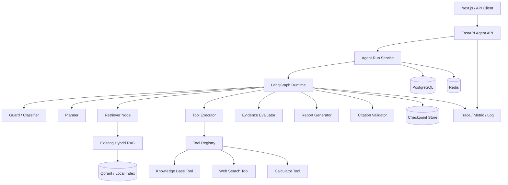
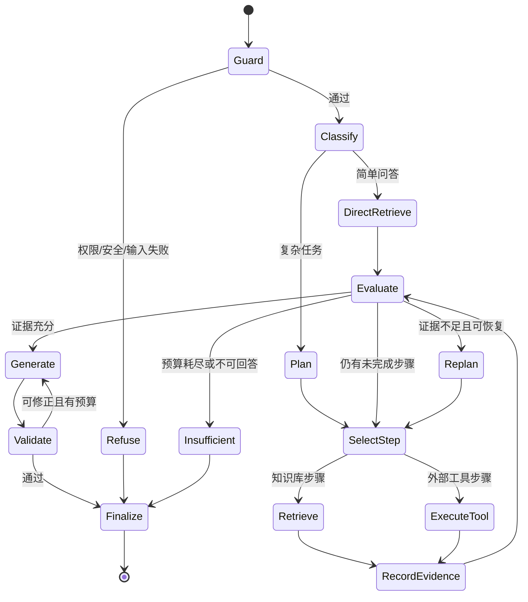
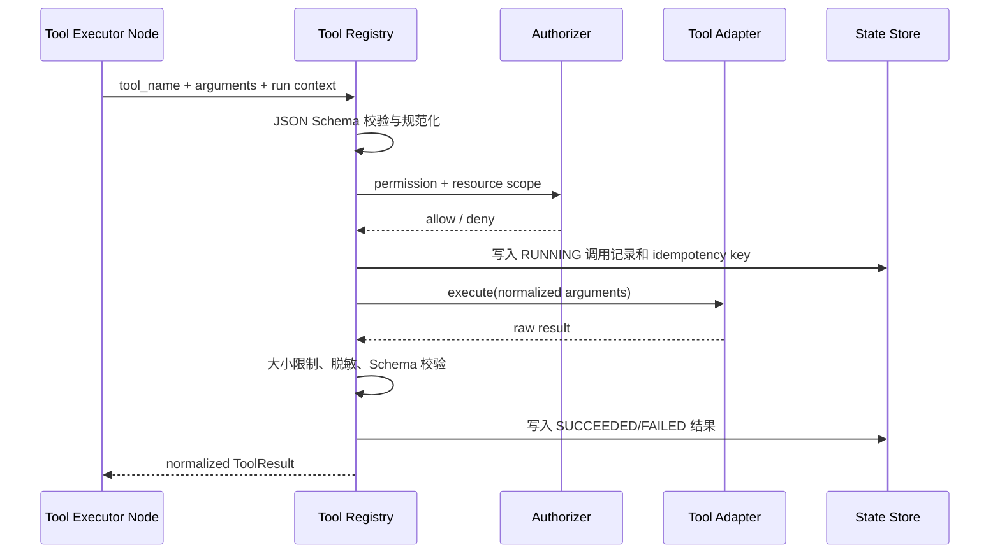
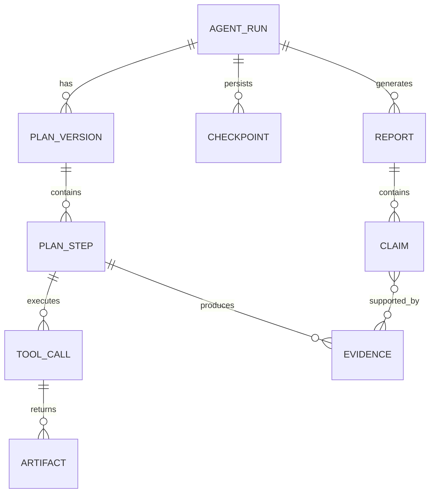
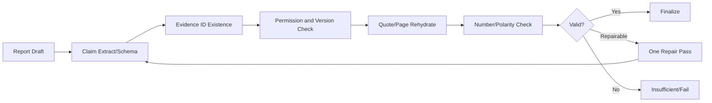
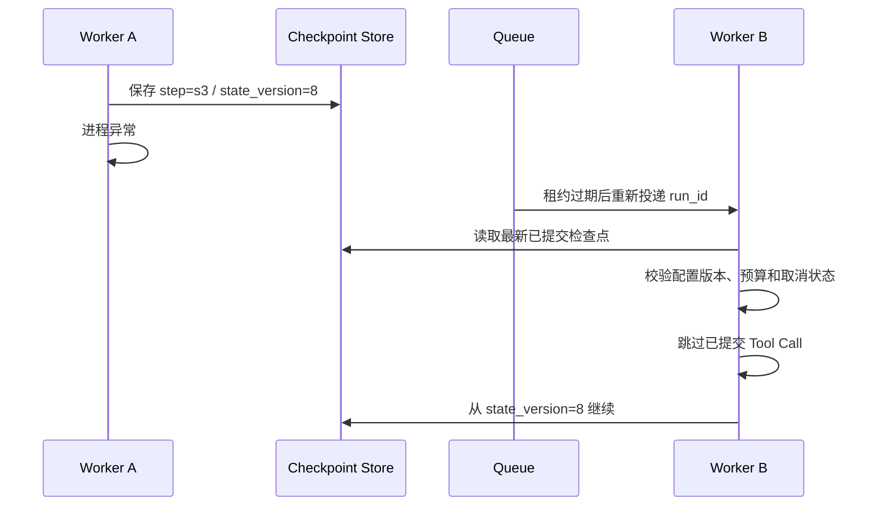
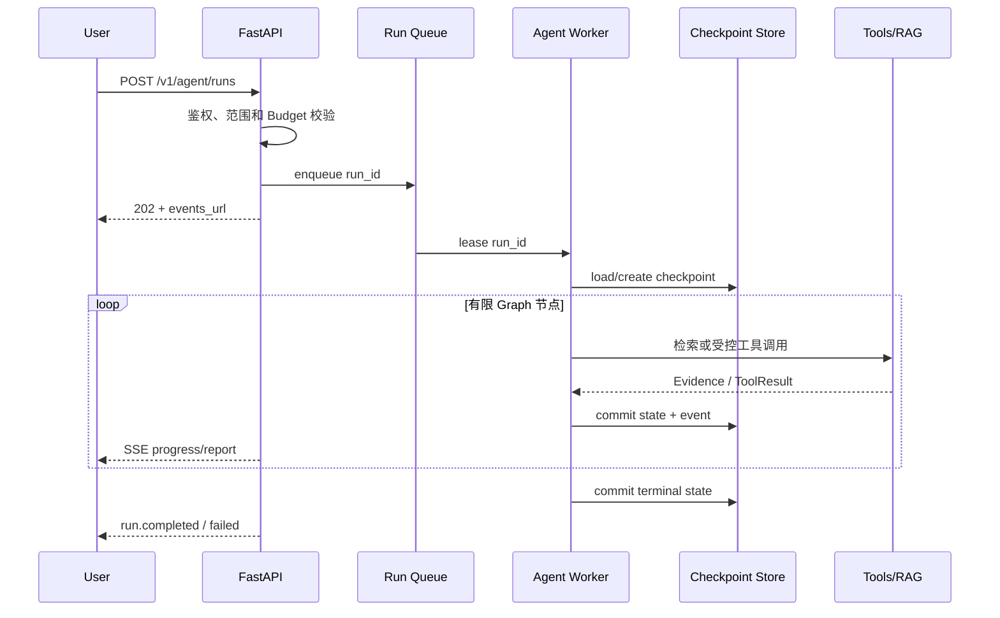

# DeepDoc Agent Agent 版本设计方案

## 1. 阶段定位

Agent 阶段在现有 RAG 0.2.0“知识库、多文档混合检索、重排、受控生成、引用回查”能力之上，引入可持久化、可中断、可恢复、具有确定终止条件的单 Agent 工作流。系统从“一次检索后直接回答”升级为“分析任务、制定计划、按步骤检索或调用工具、评估证据、必要时有限重试、生成研究报告并校验引用”。

本阶段的核心不是让模型无限自主，而是把模型决策限制在显式 LangGraph 状态机中。每个节点拥有清晰输入、输出、权限、预算和失败语义；任何循环都必须有次数、时间、Token 和成本上限。

### 1.1 建设目标

- 支持事实问答、比较分析、摘要、跨文档归纳和有限多跳研究任务。
- 使用 Planner 将复杂问题拆分为可验证的子任务和成功标准。
- 复用现有 Hybrid Retriever 作为受控知识库检索工具。
- 接入 Web Search、计算器和只读知识库工具，并通过统一 Tool Registry 管理。
- 使用 Evaluator 判断证据充分性、冲突、遗漏和引用覆盖。
- 使用 Report Generator 输出结构化、带引用、可回查的最终报告。
- 持久化 Agent Run、计划、步骤、工具调用、证据、检查点和最终结果。
- 支持 SSE 事件、暂停、取消、恢复和幂等重试。
- 建立 Agent 级任务成功率、终止正确率、工具成功率、延迟和成本基线。

### 1.2 阶段边界

Agent 版本包含：

- 单个 Orchestrator Agent 和多个确定性工作流节点。
- Planner、Retriever、Tool Executor、Evidence Evaluator、Report Generator、Citation Validator。
- 显式 LangGraph Graph、条件边和 Checkpointer。
- 知识库检索、Web Search、Calculator 三类只读工具。
- 任务级、步骤级和工具级预算。
- 人工确认协议的基础设施，但默认工具均为只读，不实现高风险写操作。
- Agent Run API、运行状态、事件流、取消和恢复。
- 自动评测用例与可观测性字段。

Agent 版本不包含：

- 多个自治 Agent 之间的委派、协商、竞争或投票。
- Supervisor 管理多个独立 Agent 的层级结构。
- 跨 Agent 的共享长期记忆、邮箱和消息总线。
- 无人确认的外部写操作、交易、发信、发布或删除。
- 完整 Eval 平台和自动发布门禁；本阶段只建立 Agent Benchmark 基线。
- Production 阶段的多租户高可用、Kubernetes、跨地域容灾和成本分摊。

Planner、Retriever、Evaluator 等名称代表一个状态图内的职责节点，不代表独立自治 Agent。Multi-Agent 能力在下一阶段单独设计。

### 1.3 成功标准

| 类别 | 验收门槛 |
| --- | --- |
| Task Success Rate | 标注集总体成功率 ≥ 0.85 |
| 事实与引用 | Faithfulness ≥ 0.90，Citation Accuracy ≥ 0.95 |
| 终止正确性 | 100% 测试任务在预算内完成、拒绝、取消或失败，不出现无限循环 |
| 工具可靠性 | 工具调用协议成功率 ≥ 0.98，参数 Schema 违规调用为 0 |
| 复杂任务 | 比较、多跳和冲突类用例成功率相比 RAG 基线提升 ≥ 15% |
| 在线性能 | 简单任务 P95 ≤ 10 秒，复杂任务 P95 ≤ 30 秒 |
| 成本 | 单次任务 Token 和费用不超过请求预算，超限任务正确终止 |
| 可恢复性 | Worker 中断后从最后已提交检查点恢复，不重复执行已提交副作用 |

## 2. 用户故事与任务分类

### 2.1 核心用户故事

1. 用户要求总结一个知识库中的核心规定，系统直接检索并生成引用报告。
2. 用户要求比较两份制度的差异，系统拆成对照维度，分别检索并合并结论。
3. 用户提出需要计算的文档问题，系统先定位数字和口径，再调用 Calculator。
4. 用户允许 Web Search 时，系统可用外部公开来源补充知识库缺口，并清楚区分来源。
5. 用户查看运行详情，可看到计划、步骤、工具参数摘要、证据、重试原因和成本。
6. 用户取消长任务后，系统停止新工具调用并将运行标记为 `CANCELLED`。
7. Worker 异常重启后，系统从检查点恢复，而不是重新执行整个任务。

### 2.2 任务复杂度

| 类型 | 示例 | 默认路径 |
| --- | --- | --- |
| SIMPLE_QA | “报销期限是多少？” | Guard → Direct Retrieve → Generate → Verify |
| SUMMARY | “总结制度的五个重点” | Plan → 多主题检索 → Report |
| COMPARISON | “比较 A/B 两份制度” | Plan → 分文档检索 → 对照汇总 |
| MULTI_HOP | “哪些条件共同导致审批升级？” | Plan → 逐步检索 → Evidence Evaluate |
| CALCULATION | “根据表中数据计算同比增长” | Retrieve → Calculator → Verify |
| OPEN_RESEARCH | “结合公开资料说明行业变化” | Plan → KB + Web Search → Report |
| UNSUPPORTED | 高风险写操作或超出权限 | Guard → Refuse |

复杂度分类用于选择工作流模板和预算，不用于改变权限。分类失败时默认选择受限的通用研究图。

## 3. 架构原则

### 3.1 显式控制优先

- 所有可执行动作必须对应图中的注册节点或注册工具。
- LLM 只能从允许的 Route、Tool 和状态转换中选择，不能生成任意代码执行。
- 状态转换由应用代码校验，模型输出只是候选决策。
- 循环边必须经过 Budget Guard 和 Progress Detector。
- 最终回答必须经过 Citation Validator，不能由 Planner 或 Tool 直接返回。

### 3.2 确定性与智能边界

确定性代码负责身份、权限、预算、Schema、幂等、缓存、超时、重试、引用回查、状态持久化和终止。LLM 负责意图理解、计划生成、证据语义评估、综合表达和有限的下一步建议。

### 3.3 状态优于对话历史

Agent 不依赖不断增长的自由文本聊天记录。计划、证据、工具结果、失败和预算均以结构化字段进入 `AgentState`，节点只读取完成任务所需的状态切片。

### 3.4 单 Agent 边界

整个 Run 只有一个 Orchestrator 身份和一个权威状态。节点不能创建独立目标、独立长期记忆或相互发送消息。这一约束降低调试和评测复杂度，并为后续 Multi-Agent 版本提供可靠基线。

## 4. 总体架构



### 4.1 运行单元

| 运行单元 | 职责 |
| --- | --- |
| FastAPI | 创建 Run、鉴权、参数校验、SSE、取消、恢复 |
| Agent Worker | 执行 LangGraph 节点、保存检查点、发送事件 |
| Ingestion Worker | 延续 RAG 文档解析和索引职责 |
| PostgreSQL | Agent Run、计划、步骤、工具调用、事件、最终结果 |
| Redis | 队列、短期状态通知、取消信号、幂等锁 |
| Checkpoint Store | LangGraph 状态快照，生产使用 PostgreSQL 实现 |
| Qdrant/Local Index | 延续 RAG 混合检索后端 |

开发模式允许 API 进程内执行 Agent 和使用 SQLite Checkpointer；生产模式必须将 Agent Worker 与 API 分离。

## 5. Agent Workflow



### 5.1 节点列表

| 节点 | 是否调用 LLM | 主要输出 |
| --- | --- | --- |
| Guard | 可选 | 安全结果、允许工具、过滤后的输入 |
| Classifier | 是 | 任务类型、复杂度、工作流模板 |
| Planner | 是 | 结构化计划、步骤、成功标准 |
| Step Selector | 否 | 下一个可运行步骤 |
| Retriever | 否/现有 RAG | 检索结果、检索 Trace |
| Tool Executor | 否 | 标准化 Tool Result |
| Evidence Recorder | 否 | 去重证据和 Provenance |
| Evaluator | 是 | 充分性、缺口、冲突、下一动作建议 |
| Replanner | 是 | 新增或修改的有限步骤 |
| Report Generator | 是 | 结构化草稿、声明与引用 ID |
| Citation Validator | 否，语义校验可选 | 通过、可修正问题、拒答原因 |
| Finalizer | 否 | 最终状态、响应、用量、审计数据 |

## 6. Agent State 设计

### 6.1 状态结构

```python
class AgentState(TypedDict):
    run_id: str
    thread_id: str
    tenant_id: str
    user_id: str
    knowledge_base_ids: list[str]
    question: str
    task_type: str
    status: str
    plan_version: int
    plan: list[PlanStep]
    current_step_id: str | None
    evidence: list[Evidence]
    tool_results: list[ToolResult]
    evaluation: Evaluation | None
    draft: ReportDraft | None
    validation: ValidationResult | None
    budget: BudgetState
    retry_counters: dict[str, int]
    errors: list[RunError]
    config_versions: ConfigVersions
    cancellation_requested: bool
```

### 6.2 状态约束

- `run_id`、身份、知识库范围和初始问题创建后不可由 LLM 修改。
- `plan_version` 单调递增；每次 Replan 保存差异和原因。
- `PlanStep.status` 只允许 `PENDING/RUNNING/SUCCEEDED/FAILED/SKIPPED`。
- Evidence ID 在一个 Run 内稳定且不可被模型伪造。
- Tool Result 仅追加，不允许模型覆盖历史结果。
- Budget 由运行时计算，模型不可增加配额。
- Final 状态一旦提交不可恢复为 Running；继续研究必须创建新 Run。

### 6.3 状态大小控制

检查点不保存完整网页、完整文档或大模型原始响应。大对象写入 Artifact Store，State 只保存 Artifact ID、摘要、哈希和 Provenance。证据正文按最终上下文预算截断，但引用定位字段保持完整。

## 7. Planner 设计

### 7.1 输入

- 用户问题、允许的知识库和工具。
- 任务类型及请求预算。
- 已知文档过滤条件和会话摘要。
- Planner Prompt、模型和 Schema 版本。

### 7.2 输出 Schema

```json
{
  "objective": "比较两份制度的报销期限与审批差异",
  "assumptions": [],
  "steps": [
    {
      "id": "s1",
      "kind": "retrieve",
      "description": "检索制度 A 的期限和审批条件",
      "depends_on": [],
      "success_criteria": ["至少一个有效引用"]
    },
    {
      "id": "s2",
      "kind": "retrieve",
      "description": "检索制度 B 的期限和审批条件",
      "depends_on": [],
      "success_criteria": ["至少一个有效引用"]
    },
    {
      "id": "s3",
      "kind": "synthesize",
      "description": "按期限和审批维度比较",
      "depends_on": ["s1", "s2"],
      "success_criteria": ["覆盖两个比较维度"]
    }
  ],
  "answer_format": "comparison_report"
}
```

### 7.3 计划校验

- 步骤数默认最多 8，硬上限 12。
- 依赖图必须无环，所有依赖 ID 必须存在。
- Step Kind 必须来自白名单。
- Tool 名称必须属于本次 Run 的允许集合。
- 计划不能扩大知识库、网络域名或身份权限。
- `synthesize` 只能依赖已声明的 Evidence-producing 步骤。
- 失败的计划允许一次 Schema 修复；再次失败回退固定研究模板。

### 7.4 Replan 规则

仅当 Evaluator 给出具体 Evidence Gap，且 Replan 次数和预算均未耗尽时执行。Replan 可以新增步骤、缩小查询或替换失败工具，不能删除已完成步骤、修改历史 Tool Result 或提升权限。

## 8. Retriever Node

Retriever Node 复用 RAG 0.2.0 的 Query Rewrite、BM25、Dense Search、RRF、Reranker 和 Citation 元数据，不重新实现检索算法。

### 8.1 输入映射

- `step.description` 形成主查询。
- Planner 提供的文档、标签和时间限制先经过权限校验。
- 依赖步骤的实体、数字或关键词可以形成有限扩展查询。
- 每一步最多三个查询，不能把整份 Tool Result 直接作为查询。

### 8.2 输出

```json
{
  "step_id": "s1",
  "query": "制度 A 报销期限 审批条件",
  "index_version": 4,
  "retrieval_profile": "hybrid-v1",
  "hits": [
    {
      "evidence_id": "ev_01",
      "chunk_id": "chunk_uuid",
      "document_id": "doc_uuid",
      "document_version_id": "docv_uuid",
      "page_from": 3,
      "page_to": 3,
      "quote": "……",
      "scores": {"rrf": 0.031, "rerank": 0.89}
    }
  ]
}
```

### 8.3 检索停止条件

- 当前步骤的成功标准已被 Evidence 覆盖。
- 连续两轮检索没有新增 Evidence。
- 单步骤查询轮次达到 3。
- 检索或总时间预算耗尽。
- 权限过滤后不存在允许文档。

## 9. Tool Registry 与 Tool Calling

### 9.1 工具协议

```python
class ToolSpec(BaseModel):
    name: str
    version: str
    description: str
    input_schema: dict
    output_schema: dict
    permission: str
    timeout_seconds: float
    max_result_bytes: int
    idempotency: str
    network_policy: str
```

每个工具实现 `validate → authorize → execute → normalize → record` 生命周期。Tool Executor 不把模型生成的 JSON 直接传给底层客户端，必须先经过 Pydantic/JSON Schema 校验、权限检查和参数规范化。

### 9.2 初始工具

| 工具 | 用途 | 权限 | 默认超时 |
| --- | --- | --- | ---: |
| `knowledge_base.search` | 调用现有 Hybrid Retriever | `kb:read` | 2 秒 |
| `knowledge_base.get_chunk` | 按 Evidence ID 回查原文 | `kb:read` | 1 秒 |
| `web.search` | 检索公开网页摘要 | `web:read` | 8 秒 |
| `web.fetch` | 获取已允许搜索结果正文 | `web:read` | 10 秒 |
| `calculator.evaluate` | 执行受限算术表达式 | `compute:basic` | 1 秒 |

不提供 Shell、任意 Python、任意文件读取、数据库 SQL 或通用 HTTP 工具。

### 9.3 Tool Calling 流程



### 9.4 Web Search 规则

- 默认关闭，由请求显式 `allow_web_search=true` 开启。
- 搜索域名可配置 Allowlist/Denylist，禁止内网地址和本机地址。
- Web 内容与知识库内容使用不同 Source Type 和引用格式。
- 抓取内容视为不可信数据，不允许其中指令进入 System Prompt。
- Robots、版权、内容长度和超时策略由 Adapter 执行。
- Web Search 失败不得降低知识库访问控制。

### 9.5 Calculator 安全

Calculator 解析抽象语法树，只允许数字、括号和白名单算术运算。禁止变量、属性访问、函数导入、文件、网络和动态代码执行。计算结果记录表达式、精度、单位假设和来源 Evidence ID。

## 10. Evidence 模型



Evidence 字段至少包含：

- `evidence_id`、`run_id`、`step_id`、`source_type`。
- 文档、版本、Chunk、页码、坐标、字符偏移。
- Web URL、标题、抓取时间和内容哈希。
- Calculator 表达式、结果及输入 Evidence。
- 原文摘录、语言、检索分数和创建时间。
- 权限快照哈希、索引和工具版本。

Evidence Recorder 按来源 ID 和内容哈希去重。新的 Evidence 只有在来源、定位或支持范围不同的情况下才计入“进展”。

## 11. Evidence Evaluator

### 11.1 评估维度

- Coverage：计划成功标准是否均有证据。
- Relevance：证据是否直接回答当前步骤。
- Consistency：来源之间是否冲突。
- Authority：知识库、官方网页和普通网页的来源等级。
- Freshness：时间敏感问题是否使用足够新的来源。
- Citation Readiness：是否具有可回查定位。
- Answerability：能否回答、只能部分回答或必须拒答。

### 11.2 输出 Schema

```json
{
  "decision": "CONTINUE|REPLAN|GENERATE|INSUFFICIENT",
  "coverage": 0.75,
  "supported_criteria": ["criterion_1"],
  "evidence_gaps": ["缺少制度 B 的审批例外"],
  "conflicts": [],
  "recommended_action": {
    "kind": "retrieve",
    "query_hint": "制度 B 审批例外 特殊金额"
  }
}
```

### 11.3 Progress Detector

运行时使用确定性指标判断进展：新增 Evidence 数、新覆盖成功标准数、计划完成步骤数和冲突解决数。连续两次 Evaluator 返回相同 Gap 且无新 Evidence 时，强制进入 `INSUFFICIENT`，防止语义上不同但实质重复的循环。

## 12. Report Generator

### 12.1 报告类型

- `direct_answer`：简洁事实问答。
- `structured_summary`：主题化摘要。
- `comparison_report`：比较矩阵、共同点和差异。
- `research_brief`：范围、发现、证据、限制和结论。
- `insufficient_report`：已查范围、证据缺口和可继续提供的信息。

### 12.2 生成输入

只传入用户问题、完成的计划摘要、选定 Evidence、工具计算结果和输出格式。失败工具的原始堆栈、未授权数据、完整运行日志和隐藏 Prompt 不进入生成上下文。

### 12.3 输出结构

```json
{
  "title": "报销制度差异分析",
  "executive_summary": "……",
  "sections": [
    {
      "heading": "期限差异",
      "content": "制度 A 要求 30 天内提交，制度 B 要求 15 天内提交。",
      "evidence_ids": ["ev_01", "ev_07"]
    }
  ],
  "limitations": [],
  "claims": [
    {"text": "制度 A 要求 30 天内提交", "evidence_ids": ["ev_01"]}
  ]
}
```

客户端展示层根据结构渲染 Markdown，不允许模型直接注入任意 HTML。

## 13. 引用验证与最终化



确定性校验包括：

- 所有 Claim 的 Evidence ID 来自当前 Run。
- Evidence 仍属于允许知识库、文档版本和用户权限范围。
- 文档摘录、页码和偏移从事实源重新读取。
- 数字、日期、单位和否定词与 Evidence 保持一致。
- Web 引用包含 URL、标题和抓取时间。
- Calculator 结论可追溯到表达式和输入 Evidence。
- 无支持事实不能进入最终报告。

最多执行一次生成修复。修复后仍失败则删除无支持 Claim 或输出证据不足报告，不能无限自我修正。

## 14. Budget 与终止条件

### 14.1 Budget 结构

| 预算 | 简单任务默认 | 复杂任务默认 | 硬上限 |
| --- | ---: | ---: | ---: |
| 总运行时间 | 15 秒 | 45 秒 | 120 秒 |
| 图节点执行 | 8 | 20 | 32 |
| Plan 步骤 | 2 | 8 | 12 |
| 检索轮次 | 2 | 8 | 12 |
| Web Search | 0 | 3 | 5 |
| Tool Calls | 2 | 8 | 12 |
| Replan | 0 | 2 | 3 |
| Generation Repair | 1 | 1 | 1 |
| 总 Token | 8K | 40K | 80K |

调用方可以在服务端允许范围内降低预算，不能超过租户和系统硬上限。

### 14.2 终止状态

- `COMPLETED`：报告通过引用校验。
- `PARTIAL`：仅部分成功标准有证据，明确披露缺口。
- `INSUFFICIENT`：已尽合理检索但证据不足。
- `REFUSED`：权限、安全或能力边界拒绝。
- `CANCELLED`：用户或系统请求取消。
- `BUDGET_EXCEEDED`：达到时间、步骤、Token 或费用上限。
- `FAILED`：不可恢复的内部错误。

### 14.3 强制终止规则

每个节点执行前和执行后都检查 Deadline、取消信号、节点计数、Token、工具次数和费用。任何预算到达硬上限时禁止创建新的 LLM 或 Tool 调用，进入 Finalizer 生成稳定终止响应。

## 15. Checkpoint、恢复与幂等

### 15.1 Checkpoint 时机

- Run 创建并完成 Guard 后。
- Plan 校验通过后。
- 每个 Tool Call 状态提交后。
- Evidence Recorder 提交后。
- Evaluator 决策后。
- Report Draft 和 Validation 后。
- 最终状态提交时。

### 15.2 恢复流程



### 15.3 幂等键

Tool Call 幂等键由 `run_id + plan_version + step_id + tool_name + normalized_arguments_hash` 组成。相同键已有成功结果时直接复用；状态不确定时根据工具幂等等级决定查询、重试或失败，不盲目重复。

## 16. 数据模型

### 16.1 `agent_runs`

- `id`、`thread_id`、`tenant_id`、`user_id`。
- `question`、`task_type`、`status`、`status_reason`。
- 知识库范围、允许工具、请求 Budget 和剩余 Budget。
- 当前节点、State Version、Checkpoint ID。
- 模型、Prompt、Graph、Tool Registry 和检索配置版本。
- 输入输出 Token、费用、开始、完成和更新时间。

### 16.2 `agent_plan_versions` 与 `agent_steps`

Plan Version 保存完整计划、变更原因和 Planner 原始结构化输出哈希。Step 保存 Kind、描述、依赖、成功标准、状态、尝试次数、开始结束时间和错误码。

### 16.3 `tool_calls`

保存工具名和版本、规范化参数、权限决策、幂等键、状态、结果 Artifact ID、错误码、耗时和用量。敏感参数只保存脱敏版本。

### 16.4 `agent_evidence`

保存来源类型、来源定位、Quote、内容哈希、所属步骤、索引版本、检索分数和权限快照。正文较大时保存 Artifact 引用。

### 16.5 `agent_events`

使用 Run 内单调递增 `sequence_number`，支持 SSE 断线后通过 `Last-Event-ID` 续传。事件写入和状态变更在同一事务边界或 Outbox 模式中提交。

## 17. API 设计

### 17.1 创建 Run

`POST /v1/agent/runs`

```json
{
  "question": "比较两个知识库中的报销制度，并计算期限差值",
  "knowledge_base_ids": ["kb_a", "kb_b"],
  "allow_web_search": false,
  "output_format": "comparison_report",
  "budget": {
    "max_duration_seconds": 45,
    "max_tool_calls": 8,
    "max_total_tokens": 40000
  }
}
```

返回 `202`：

```json
{
  "id": "run_uuid",
  "status": "QUEUED",
  "events_url": "/v1/agent/runs/run_uuid/events"
}
```

### 17.2 核心接口

| 方法 | 路径 | 说明 |
| --- | --- | --- |
| `POST` | `/v1/agent/runs` | 创建 Agent Run |
| `GET` | `/v1/agent/runs/{id}` | 获取状态、计划摘要、结果和用量 |
| `GET` | `/v1/agent/runs/{id}/events` | SSE 事件流与断线续传 |
| `POST` | `/v1/agent/runs/{id}/cancel` | 幂等请求取消 |
| `POST` | `/v1/agent/runs/{id}/resume` | 恢复可恢复的中断 Run |
| `GET` | `/v1/agent/runs/{id}/steps` | 查询步骤和状态 |
| `GET` | `/v1/agent/runs/{id}/evidence` | 查询用户可见 Evidence |
| `GET` | `/v1/agent/tools` | 查询允许的工具及版本 |

### 17.3 请求生命周期



### 17.4 SSE 事件

- `run.created`、`run.started`、`run.completed`、`run.failed`。
- `plan.created`、`plan.revised`。
- `step.started`、`step.completed`、`step.failed`。
- `tool.started`、`tool.completed`、`tool.failed`。
- `evidence.added`、`evaluation.completed`。
- `report.delta`、`citation`、`usage`。
- `run.cancelled`、`budget.exceeded`、`heartbeat`。

事件不暴露 Chain-of-Thought、隐藏系统提示或完整工具凭据。Plan 仅返回用户可理解的任务步骤和进度摘要。

## 18. 并发、队列与调度

- API 创建 Run 后写数据库与 Outbox，再由 Dispatcher 投递队列。
- 同一 Run 同时只能有一个有效执行租约。
- Worker 定期续租；租约过期后任务可重新投递。
- 同一用户和租户设置并发 Run 上限。
- Tool 设置独立并发信号量，避免 Web 或模型服务被瞬时压垮。
- 取消信号写入 PostgreSQL 并通过 Redis Pub/Sub 加速通知。
- 简单任务可使用 Fast Lane，复杂任务进入 Standard Queue，不能由用户伪造优先级。

## 19. 安全与治理

### 19.1 权限传播

用户身份、租户、知识库 ACL 和允许工具在 Run 创建时确定。每次 Retriever 和 Tool Call 再次执行资源级授权，不能只信任初始检查或 Planner 输出。

### 19.2 Prompt Injection 防护

- System Instruction、用户请求、计划、工具结果和外部内容使用明确消息边界。
- 文档和网页一律标记为不可信 Evidence。
- Evidence 中出现的“忽略之前指令”“调用工具”等文本不得进入控制通道。
- Tool Name 和参数来源受 Schema 约束，不解析自然语言中的伪 Tool Call。
- 安全回归集包含恶意 PDF、网页和跨文档间接注入。

### 19.3 数据与日志

- 日志和 Trace 不记录完整文档、完整网页、API Key 或模型隐藏提示。
- Tool 参数和结果按字段脱敏，Artifact 继承租户和 Run ACL。
- Evidence API 只返回当前用户仍有权限访问的内容。
- Run 删除采用 Tombstone 和异步清理，审计保留按策略执行。

### 19.4 人工确认

本阶段默认工具均为只读，不触发确认。框架预留 `WAITING_FOR_APPROVAL` 状态和 Approval Record，未来引入写工具时必须在实际执行前暂停，并展示动作、目标、影响和有效期。

## 20. 错误处理与降级

| 故障 | 行为 |
| --- | --- |
| Classifier 失败 | 使用受限通用研究模板 |
| Planner Schema 失败 | 修复一次，再回退固定模板 |
| 知识库检索失败 | 有 Web 权限时可补充，否则部分回答或失败 |
| Web Search 失败 | 保留知识库证据并标记外部来源不可用 |
| Calculator 参数非法 | Tool Call 失败，Evaluator 决定修正或停止 |
| Evaluator 失败 | 使用确定性 Coverage 规则决定 Generate/Insufficient |
| Report Generator 失败 | 有预算时重试一次，否则 FAILED |
| Citation Validator 失败 | 修复一次，仍失败则删除 Claim 或 Insufficient |
| Checkpoint Store 不可用 | 停止新节点，不进行无检查点的工具调用 |
| Redis 不可用 | 使用数据库轮询取消和队列降级，不影响权限正确性 |

错误记录包含 `code`、`node`、`step_id`、`retryable`、`attempt`、`trace_id` 和脱敏详情。对外不返回堆栈、模型原始错误或凭据。

## 21. 可观测性

### 21.1 Trace

根 Span 为 `agent.run`，子 Span 包括：

- `agent.guard`、`agent.classify`、`agent.plan`。
- `agent.step.select`、`agent.retrieve`、`agent.tool.execute`。
- `agent.evidence.record`、`agent.evaluate`、`agent.replan`。
- `agent.report.generate`、`agent.citation.validate`、`agent.finalize`。

Span 记录 Run/Step/Tool ID、状态、模型和配置版本、Token、费用、证据数、缓存命中、重试和耗时，不记录敏感正文。

### 21.2 Metrics

- Run 创建、完成、部分完成、拒绝、取消、预算耗尽和失败数。
- 各任务类型 Task Success Rate。
- 每节点 P50/P95、排队时间、总运行时间和 TTFE。
- Plan 步骤数、Replan 次数、无进展终止数。
- Tool 成功、超时、Schema 失败、权限拒绝和重试率。
- Evidence 数、来源分布、冲突数、引用通过率。
- 输入输出 Token、缓存命中、单 Run 和成功任务平均费用。
- Checkpoint 保存延迟、恢复次数和重复调用拦截数。

### 21.3 告警

对失败率、预算耗尽率、循环保护触发率、Tool 超时率、引用失败率、队列积压、Checkpoint 错误和单位成功任务成本设置趋势告警。

## 22. 测试策略

### 22.1 单元测试

- State Reducer、不可变字段、状态转换和 Final 状态保护。
- Plan Schema、无环依赖、步骤和工具白名单。
- Budget 扣减、Deadline、节点计数和强制终止。
- Progress Detector 对重复 Evidence 和重复 Gap 的判断。
- Tool Registry 参数校验、权限、超时、大小限制和脱敏。
- Calculator AST 白名单和恶意表达式拒绝。
- Evidence 去重、Provenance 和引用回查。
- Checkpoint 序列化、版本兼容和恢复路由。

### 22.2 Graph 测试

使用 Fake Planner、Fake Evaluator、Fake LLM 和 Fake Tool：

- 简单问答走 Direct Retrieve，不调用 Planner。
- 复杂比较生成计划并按依赖执行。
- Evidence 足够时不发生额外检索。
- Evidence 不足时最多 Replan 配额。
- 连续无进展正确进入 `INSUFFICIENT`。
- Budget 耗尽在下一外部调用前停止。
- Citation Repair 最多执行一次。
- Cancel 信号在节点边界生效。

### 22.3 契约测试

- LangGraph Checkpointer 与 State Schema。
- Hybrid Retriever Tool、Web Search Adapter、Calculator。
- Planner、Evaluator、Report Generator 的结构化模型输出。
- Queue、租约、Outbox 和 SSE Event Schema。

### 22.4 集成与恢复测试

- 创建 Run → Plan → Retrieve → Evaluate → Report → Citation → Complete。
- 多步检索和 Calculator 的 Provenance 闭环。
- Worker 在 Tool 完成后崩溃，恢复时不重复调用。
- SSE 断线后通过 Last-Event-ID 补发事件。
- 取消、超时、预算耗尽和 Checkpoint 失败。
- RAG 旧问答 API 行为不回退。

### 22.5 安全测试

- 恶意文档和网页的间接 Prompt Injection。
- Planner 试图扩大知识库或工具权限。
- Tool 参数注入、SSRF、超大响应和敏感字段泄露。
- 跨租户 Evidence ID、Checkpoint 和 Artifact 访问。
- Calculator 代码执行、属性访问和资源消耗攻击。

## 23. Agent Benchmark

### 23.1 数据集

至少准备 150 个任务：

| 类型 | 数量 | 主要检查 |
| --- | ---: | --- |
| 简单事实 | 25 | 是否选择 Direct Retrieve |
| 结构化摘要 | 20 | 覆盖率和引用 |
| 双文档比较 | 25 | 计划、双方证据、比较维度 |
| 多跳推理 | 20 | 步骤依赖和中间证据 |
| 数字计算 | 15 | Calculator、精度、Provenance |
| 知识库 + Web | 15 | 来源区分和时效性 |
| 冲突信息 | 10 | 冲突披露而非擅自消解 |
| 不可回答 | 10 | 正确 Insufficient |
| 注入和越权 | 10 | 安全拒绝与无泄漏 |

### 23.2 指标

- Task Success Rate、Plan Validity、Step Completion Rate。
- Tool Selection Accuracy、Tool Call Success Rate。
- Evidence Coverage、Evidence Precision、Conflict Detection Recall。
- Faithfulness、Citation Precision/Recall/Accuracy。
- Correct Termination Rate、Loop Prevention Rate、Recovery Success Rate。
- P50/P95、节点数、Tool Calls、Token、费用和单次成功成本。

### 23.3 基线与消融

比较以下配置：

1. RAG 0.2.0 单次检索基线。
2. Agent 无 Evaluator。
3. Agent 有 Evaluator、无 Replan。
4. 完整单 Agent Graph。

只有复杂任务收益显著且简单任务延迟可控时才默认启用 Agent。简单事实问题若 Agent 路径无收益，应继续走 Direct RAG Fast Path。

## 24. RAG 到 Agent 的迁移

### 24.1 兼容原则

- 保留所有 `/v1/knowledge-bases`、`/search`、`/questions` 和索引 API。
- Agent Retriever 通过内部 Adapter 调用 RAG Service，不复制检索代码。
- 现有 `qa_runs` 保持只读兼容，新任务写入 `agent_runs`。
- RAG Citation 转换为 Agent Evidence，但保持 Chunk、文档、页码和版本 ID。
- 旧客户端不必迁移；需要复杂研究时才调用 `/v1/agent/runs`。

### 24.2 数据迁移

Agent 表以新增迁移创建，不修改已有文档与 Chunk 主键。Graph、Prompt、Tool Registry 和 State Schema 全部版本化。部署先创建表和只读 Tool Adapter，再灰度开放 Agent API。

### 24.3 灰度策略

- 第一阶段只允许内部测试用户和知识库工具。
- 第二阶段开放 Calculator 和比较任务。
- 第三阶段按租户白名单开放 Web Search。
- 每阶段比较 RAG 和 Agent 的质量、延迟、成本与错误率。
- 配置开关可以关闭 Agent 新建请求，已有 Run 继续或安全终止。

### 24.4 回滚

Agent API 与 RAG API 解耦。回滚时停止创建新 Agent Run，将队列中 Run 标记为取消或允许完成，不回滚 RAG 数据和索引。数据库新增表保留，旧应用版本忽略它们。

## 25. 推荐代码结构

```text
app/
├── agents/
│   ├── graph.py
│   ├── state.py
│   ├── routing.py
│   ├── budgets.py
│   ├── checkpoints.py
│   ├── events.py
│   └── nodes/
│       ├── guard.py
│       ├── classify.py
│       ├── planner.py
│       ├── retrieve.py
│       ├── tool_executor.py
│       ├── evaluator.py
│       ├── report.py
│       └── validate.py
├── tools/
│   ├── registry.py
│   ├── schemas.py
│   ├── knowledge_base.py
│   ├── web_search.py
│   └── calculator.py
├── retrieval/
├── citations/
├── infrastructure/
│   ├── checkpoints/
│   ├── queue/
│   └── artifacts/
└── api/
    └── agent_runs.py
tests/
├── unit/agents/
├── unit/tools/
├── graph/
├── contract/
├── integration/
├── recovery/
├── security/
└── evaluation/
```

## 26. 实施里程碑

### A1：Agent 基础模型与运行存储

- 引入 LangGraph、Agent State、状态转换和版本字段。
- 建立 Agent Run、Plan、Step、Event 和 Checkpoint 表。
- 实现创建、查询、SSE 和取消 API。
- 完成 State、Budget、Event 和迁移测试。

### A2：Planner 与 RAG Fast Path

- 实现 Guard、Classifier、Planner 和 Plan Validator。
- 简单问题走 Direct RAG，复杂问题生成计划。
- 将现有 Hybrid Retriever 包装为知识库 Tool。
- 完成 Graph 路由和 RAG 回归测试。

### A3：Tool Registry

- 实现 Tool Spec、Registry、Authorizer、执行记录和幂等。
- 实现 Calculator、Web Search/Fetched Content Adapter。
- 加入超时、响应大小、网络策略和脱敏。
- 完成契约、安全和故障注入测试。

### A4：Evaluator 与有限循环

- 实现 Evidence Recorder、Evaluator、Progress Detector 和 Replanner。
- 接入所有 Budget 与终止状态。
- 实现 Checkpoint 恢复、租约和重复调用拦截。
- 完成循环、取消、恢复和预算测试。

### A5：Report、引用与评测

- 实现结构化 Report Generator 和 Citation Validator。
- 建立 Agent Benchmark、RAG 对照和消融报告。
- 完成可观测性、运行手册、灰度和回滚演练。
- 达到验收门槛后发布 `agent-graph-v1`。

每个里程碑必须包含代码、迁移、测试、文档和独立 Git commit。

## 27. 配置与版本治理

必须版本化：

- `graph_version`、`state_schema_version`、`checkpoint_schema_version`。
- Planner、Evaluator、Report Prompt 和模型版本。
- Tool Registry、Tool Adapter 和 JSON Schema 版本。
- RAG Retrieval Profile、Embedding、Reranker 和索引版本。
- Budget Profile、Safety Policy 和输出格式版本。

Run 创建时固定配置快照；恢复时默认继续使用原版本。若原模型或工具已不可用，只允许执行显式兼容迁移或将 Run 标记为不可恢复，不能静默切换后继续。

## 28. 主要风险与治理

| 风险 | 治理措施 |
| --- | --- |
| Agent 无限循环 | 有限图、Budget Guard、Progress Detector、硬终止 |
| Planner 生成不可执行计划 | JSON Schema、DAG 校验、白名单、固定模板回退 |
| 工具误用或越权 | Registry、逐次授权、最小权限、无通用执行器 |
| 外部内容 Prompt Injection | 不可信数据边界、工具控制面隔离、安全回归集 |
| Web 来源质量不稳定 | 来源等级、时间戳、域名策略、证据冲突披露 |
| 恢复导致重复调用 | Checkpoint、租约、幂等键、Tool 调用状态机 |
| Evaluator 自我确认偏差 | 确定性 Coverage、消融评测、人工标注校准 |
| 简单任务延迟和费用上升 | Classifier + Direct RAG Fast Path |
| 状态和上下文膨胀 | Artifact Store、状态切片、摘要和硬大小限制 |
| 隐藏推理泄漏 | 只输出进度摘要，不保存或返回 Chain-of-Thought |

## 29. 待确认 ADR

实施前提交：

1. `ADR-007`：LangGraph Graph 与 Checkpointer 的运行模型。
2. `ADR-008`：Agent Queue、Worker 租约和 Outbox 一致性。
3. `ADR-009`：Planner/Evaluator/Report 模型选择与回退。
4. `ADR-010`：Web Search Provider、域名策略和内容合规。
5. `ADR-011`：Artifact Store、保留期和权限继承。
6. `ADR-012`：Budget Profile、租户上限和成本计量。
7. `ADR-013`：人工确认协议与未来写工具边界。

每个 ADR 记录候选方案、评测证据、影响、迁移和撤销条件。

## 30. 完成定义

Agent 阶段仅在以下条件全部满足后完成：

- 单 Agent LangGraph 可以完成简单、比较、摘要、多跳和计算任务。
- Planner、Retriever、Tool Executor、Evaluator、Report Generator 和 Citation Validator 均有明确契约。
- 所有循环受步骤、时间、Tool、Token、费用和无进展条件限制。
- Checkpoint、取消、恢复和工具幂等经过故障注入验证。
- 知识库、Web 和 Calculator 工具通过权限、安全和契约测试。
- 最终报告的事实 Claim 均可映射到有效 Evidence。
- Agent Benchmark 达到 Task Success、引用、终止、延迟和成本门槛。
- RAG API 和现有 0.2.0 行为无回退。
- Trace、Metric、Log、错误码和运行手册齐全。
- 代码、迁移、配置、文档和测试全部通过，并创建对应 Git commit。

完成本阶段后，下一阶段才能在稳定的单 Agent 基线上引入 Supervisor、专业 Agent、消息协议、委派、共享记忆和 Multi-Agent 评测。
