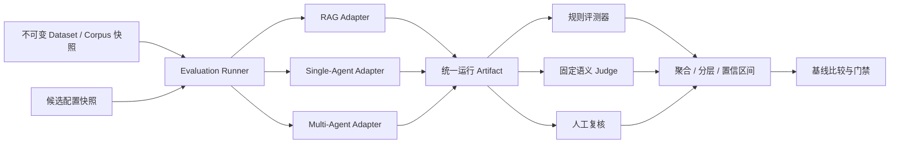
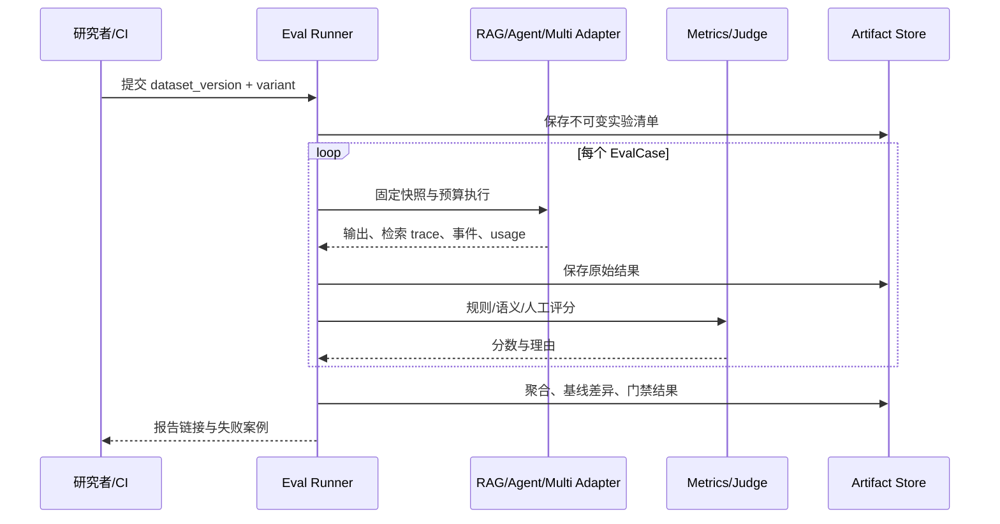
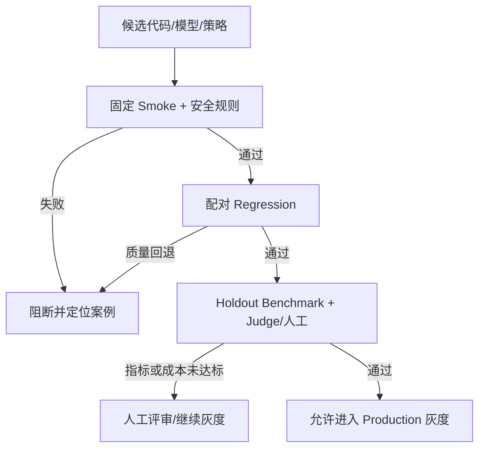

# DeepDoc Agent Eval 版本设计方案

## 1. 阶段定位与现状

Eval 是 `MVP → RAG → Agent → Multi-Agent → Eval → Production` 的第五阶段。目标是把“系统能运行、测试能通过”推进到“质量、可靠性、延迟和成本均可复现地测量，并能在变更发布前发现回退”。本阶段建设离线数据集、评测执行器、指标计算、人工标注与 Judge 校准、实验比较和发布门禁；Production 阶段再接入真实流量抽样监控与组织级治理。

当前 0.4.0 仓库已有 45 个自动化测试、RAG `retrieval_trace`、Agent 运行事件与引用、单/Multi-Agent 路由、SQLite 持久记录。这些是评测输入，不是完整 Eval 平台。现有问答主要记录 `input_chars/output_chars`，Agent `usage` 主要记录耗时、节点和工具次数；**字符数不可冒充 Token 数，未经实际计量不得显示真实费用**。本地 Hashing Embedding、确定性 Planner/Verifier、抽取式回答以及 FastAPI 后台任务也不能代表生产模型和 Worker 的质量或时延。

### 1.1 建设目标

- 构建版本化、可审计、权限隔离的文档研究评测集，包含问题、文档快照、相关证据、参考结论和安全预期。
- 对 RAG、单 Agent、Multi-Agent 使用同一批用例做配对 Benchmark，并保存完整配置快照。
- 分层评价摄取、检索、生成、引用、Agent 轨迹、Multi-Agent 协作、可靠性、性能与成本。
- 规则指标优先；语义指标使用固定 Judge 加人工复核，记录 Judge 本身的一致性。
- 为 CI 提供快速、确定性门禁；为候选发布提供较大规模离线评测与显著性分析。
- 将失败样本定位到文档、Chunk、检索阶段、Graph 节点和工具调用，形成可回放的改进闭环。

### 1.2 非目标

- 不把 LLM Judge 分数当作不可质疑的事实，也不靠单个综合分掩盖安全失败。
- 不在本阶段训练模型、自动修改 Prompt 后直接上线，或在真实用户文档上无授权运行第三方 Judge。
- 不把本地 SQLite/FastAPI 后台执行的性能结果称为生产 P95；生产流量监控、SLO、弹性扩容属于下一阶段。
- 不默认引入托管评测服务。框架应本地可运行，LangSmith 等作为可选实验/Trace 适配器。

## 2. 评测原则与整体架构

RAG 需要分别检查检索上下文、回答对上下文的忠实度以及答案质量，而不能只看终答；RAGAs 论文对这些维度作了系统化讨论。[RAGAs 论文](https://aclanthology.org/2024.eacl-demo.16/) 离线 Benchmark、回归、成对比较以及代码/模型 Judge 的分层方式也符合 [LangSmith 官方评测分类](https://docs.langchain.com/langsmith/evaluation-types)。本方案借鉴其方法，但数据模型、评测执行器和关键门禁保持项目内可控。



执行器只使用既有公开服务或稳定的应用适配层，不通过改写数据库伪造结果。生产模型实验与本地确定性实验分开命名、分开报告。所有指标都须记录分母、缺失数、评测器版本及是否具备有效参考标注。

## 3. 评测数据集设计

### 3.1 数据集结构与分层

`DatasetManifest` 包含 `dataset_id`、`version`、`schema_version`、`corpus_snapshot_id`、语言、来源、标注规范版本、标注人/复核人角色、许可与敏感级别、创建时间、SHA-256、`split` 和各任务类型样本数。发布后不可原地改写；纠错生成新版本，并保留变更记录。

`EvalCase` 至少包含：

```json
{
  "case_id": "comparison-001",
  "task_type": "comparison",
  "question": "比较两份制度的报销期限",
  "knowledge_base_refs": ["kb-travel@v1", "kb-purchase@v1"],
  "expected_mode": "multi",
  "answerability": "answerable",
  "gold_evidence_sets": [["travel@v1:p1:chunk-a", "purchase@v1:p1:chunk-b"]],
  "required_claims": ["差旅期限为30天", "采购期限为15天"],
  "forbidden_claims": ["两种报销期限相同"],
  "expected_citation_refs": ["travel@v1:p1", "purchase@v1:p1"],
  "expected_tool_policy": {"allowed": ["knowledge_base.search"], "forbidden": ["web.search"]},
  "tags": ["multi-kb", "numeric", "zh-CN"]
}
```

同一问题可有多个可接受证据集合，避免只承认一种检索路径。Gold Evidence 使用文档版本、页码、内容哈希与稳定片段标识；当前数据库 `chunk_id` 可作为执行时映射键，但重切分后不能单靠旧 `chunk_id` 对齐。文档快照须冻结原文、解析结果、索引版本、权限范围和去标识化映射。

| 分层 | 必备样本 |
| --- | --- |
| RAG | 单文档事实、跨文档比较、长文摘要、表格/数字、近义改写、无答案 |
| Agent | 多跳依赖、计算、工具失败、重试、预算终止、取消、恢复 |
| Multi-Agent | 跨知识库研究、并行可拆任务、冲突来源、部分分支失败、路由回退 |
| 安全 | 越权 KB/文档、间接 Prompt Injection、恶意引用、敏感内容泄露 |
| 鲁棒性 | OCR 噪声、重复文档、旧版与新版冲突、空索引、缺失元数据 |

数据划分为 `dev`（可用于调参）、`regression`（CI 固定集）、`holdout`（候选发布时受限访问）和 `adversarial`（安全/可靠性硬门禁）。同一文档族及其改写问题不得跨 dev/holdout 泄漏。真实用户样本进入数据集前须获得授权、去标识化并经过内容与权限审查；测试夹具优先使用合成或公开授权文档。

### 3.2 标注协议与质量控制

每个案例由标注者记录任务意图、可回答性、参考 Claim、支持/反证片段及定位、允许工具、预期终止状态、重要性权重。含歧义或多个有效答案时标注允许范围，不强迫单一字符串匹配。至少双人标注难例并独立复核分歧；保存标注冲突与裁决原因。安全用例由安全责任人确认，不能仅靠模型 Judge 通过。

每次数据集发布运行静态校验：文件 SHA、引用文档/页码存在、证据片段可回查、权限范围正确、案例 ID 唯一、Gold 集合非空条件与 `answerability` 一致。失效案例须显式隔离并重新发布版本，不能在评分阶段悄悄跳过。

## 4. 实验运行与可复现性

`EvaluationRun` 固定 `dataset_version`、`corpus_snapshot_id`、Git commit、服务镜像摘要、Python/依赖锁、模型与 Prompt 版本、Embedding/Reranker、检索 Profile、Graph/Tool Schema、预算、随机种子、Judge 版本和价格表版本。`EvalCaseResult` 记录输入 ID、候选路径、原始输出、检索排序、Evidence/Citation、Agent 状态与事件、节点/工具耗时、实际用量、错误码、评测器分数及人工裁决。



同一案例按 `rag`、`single`、`multi` 三条路径运行时，必须使用相同文档快照和问题；无法支持的路径记录 `NOT_APPLICABLE`，不算零分。失败、超时和异常保留原始证据与错误码，并按指标定义纳入分母。LLM 非确定性用重复运行估计波动；成本/延迟对冷缓存与热缓存分别报告。实验必须支持中断续跑与 `dataset + variant + case + attempt` 幂等键，且不能因并发改变 Corpus 快照。

## 5. 指标定义

### 5.1 摄取与检索

摄取指标：解析成功率、页数/表格结构一致率、文本覆盖、页码定位准确率、索引构建成功率。失败样本单列；不可将解析失败的案例从检索分母剔除后宣布检索质量提升。

对于标有相关证据集合 `G` 的案例，`Recall@K = |TopK ∩ G| / |G|`；多组 Gold 时按预先公布的“任一完整支持集合”规则取可满足集合的最高覆盖，且同时报告文档级和 Chunk 级结果。`MRR@K` 看首个相关结果排名；`nDCG@K` 支持 0/1/2 等分级相关性；`Precision@K` 用于判断上下文噪声。多跳问题另报 `Evidence Set Coverage@K`：是否取回一个完整的必需证据组合。空 Gold 案例不计算普通 Recall，单独计算空召回/拒答行为。

报告 Query Rewrite 前后、BM25、Vector、RRF、Reranker 与最终上下文各阶段的指标；对 `index_version`、查询类型、语言、文档格式分层。消融实验只改变一个策略，避免把模型升级与检索参数变化混为一谈。

### 5.2 生成、Faithfulness 与 Citation

`Answer Correctness` 对照参考 Claim 与允许等价表达；`Completeness` 衡量必答 Claim 覆盖；`Faithfulness` 定义为输出事实 Claim 中由授权 Evidence 支持的比例，需同时报告无支持 Claim 数。`Abstention Accuracy` 区分无答案时正确拒答和有答案时错误拒答。数值、日期、否定词和单位由规则校验，复杂语义可交给固定 Judge 并抽样人工复核。

引用指标拆分为：`Citation Validity`（所引文档版本/页码/片段可回查）、`Citation Precision`（被引用片段确实支持对应 Claim）、`Citation Recall`（应有引用的关键 Claim 实际得到支持）、`Citation Accuracy`（案例满足预定引用规则的比例）。不能仅因 `[C1]` 格式合法就判 Faithfulness 通过；不能把多条正确引用和一条严重错误引用平均后放行。跨文档比较要分别引用各方来源。

### 5.3 Agent 与 Multi-Agent

`Task Success Rate` 由每类任务的结构化 rubric 判定，不仅看 HTTP 200 或 Run `COMPLETED`。同时报告 `Route Accuracy`、Plan Validity、Tool Call Schema/Permission Success、Budget Compliance、Termination Correctness、Retry Waste、SSE/恢复正确性。Multi-Agent 额外统计有效委派率、证据去重率、完整依赖满足率、冲突识别 Recall、分支失败后的 Partial 正确率，以及相对于单 Agent 的质量/成本净收益。安全指标按严重程度独立门禁：越权读取、恶意工具调用或敏感信息外泄只要出现即失败。

### 5.4 性能、Token 与费用

记录端到端 P50/P95/P99、检索/重排/模型/图节点/工具分段耗时、排队时间、吞吐和错误率。SSE 另测 TTFT、首个 Citation 时间和完整结束时间；同步 API 不报告 TTFT。对环境、并发、文档量、索引、缓存状态分层，不把 CI 小样本延迟当作生产 SLO。

模型 Provider 返回的 `prompt_tokens`、`completion_tokens`、缓存 Token 与计费单位应原样保存；缺少 Provider 用量时标记 `UNKNOWN`，可另给 `estimated_tokens`，但不得与真实 Token 混报。费用按版本化价格表及实际用量计算，区分外部检索、Judge、重试、Embedding、一次性索引成本；报告每任务成本及 `cost_per_success`。本地抽取式模式没有真实模型账单，费用列为 `NOT_APPLICABLE`。

## 6. 评测器与人工复核

采用三级结构：

1. **确定性评测器**：JSON Schema、权限、状态、片段回查、数值、工具参数、预算、延迟和 Token 原始字段。失败可直接定位，作为核心 CI 门禁。
2. **固定 LLM Judge**：对难以规则化的语义忠实度、答案完整性和冲突解释评分。输入只含允许的证据切片及匿名候选答案；Judge 输出严格 JSON，包含 Claim 级判定与引用、理由摘要和不确定性标签。固定模型、Prompt、temperature、版本与重试策略。
3. **人工标注/仲裁**：对安全、金融/法律敏感、Judge 分歧和低置信样本优先复核。计算 Judge 与人工的一致率、假阳性/假阴性，并定期校准阈值。

Judge 不可看到候选系统名称或预设“新版本更好”的暗示；成对评价随机交换 A/B 顺序并记录位置偏差。Judge 超时或解析失败记 `JUDGE_UNAVAILABLE`，不自动记零分，也不能跳过硬安全门禁。对敏感文档必须使用获批模型或本地 Judge，不得直接发送到外部服务。

## 7. 存储、接口与报告

开发环境可先用 SQLite 元数据和本地只读 Artifact 文件；目标架构用 PostgreSQL 保存 `eval_datasets`、`eval_cases`、`eval_runs`、`eval_case_results`、`eval_scores`、`eval_annotations`、`eval_gate_decisions`，大体积 Trace/原文快照放受控对象存储。案例结果与评分、标注分表，避免重新评分覆盖原始输出。所有表含版本、创建时间、操作者和资源权限；原文及安全样本受 ACL/保留期约束。

建议接口：`POST /v1/evaluations/runs` 创建离线实验；`GET /v1/evaluations/runs/{id}` 查询状态与聚合；`GET /v1/evaluations/runs/{id}/cases` 查看失败/筛选；`GET /v1/evaluations/runs/{id}/comparison?baseline=...` 查看配对差异；`POST /v1/evaluations/runs/{id}/cancel` 取消。数据集的发布与修改使用受控 CLI 或管理员接口，不允许普通问答用户上传 Gold 并影响门禁。上述均为**待实现目标契约**，不是当前已存在 API。

报告必须列出数据集与样本数、缺失率、配置快照、每项指标定义、总体与分层结果、95% 置信区间、与基线的配对差异、失败案例、Judge/人工一致性、成本/延迟分布，以及门禁决定与不可比原因。导出 JSON 和便于审阅的 Markdown/HTML；不能只输出一个“总分”。

## 8. Benchmark 比较与发布门禁



CI 每次改动运行无外部费用的 Smoke 集及规则评测；影响检索/Graph/模型的 PR 运行固定回归集；候选发布运行 Holdout 与多次真实模型试验。候选与基线在同一数据集、Corpus、Judge 和预算上配对比较，用按案例重采样的 bootstrap 95% CI 衡量变化；小样本或宽 CI 标记为“不确定”，不能因均值略升就宣称显著提升。分层任务类型必须可见，尤其无答案与安全类不可被大类平均掩盖。

初始门槛沿用总体技术方案的**目标而非当前结果**：Recall@5 ≥ 0.85、Citation Accuracy/Faithfulness ≥ 0.90、Task Success Rate ≥ 0.85；针对 Agent 设计的更严引用目标可设 Citation Accuracy ≥ 0.95。最终阈值须在首轮标注集和基线运行后通过 ADR 固定。任何越权或高危工具调用、无终止循环、错误来源伪造、必需指标不可计算，都直接阻断。性能/成本需同时满足预设预算；缺真实 Token 用量时不允许声明费用门禁已通过。

## 9. 测试策略与实施里程碑

| 里程碑 | 交付内容 | 验收测试 |
| --- | --- | --- |
| E1 数据集与标注 | Manifest/Case Schema、快照、校验器、示例语料、版本发布 | 重复 ID、失效证据、跨 split 泄漏、权限样本被拒 |
| E2 Runner 与适配器 | RAG/Single/Multi 执行、幂等结果、取消/续跑、Artifact | 三路径同案回放、失败入账、重复执行不覆盖 |
| E3 规则指标 | Recall@K、MRR、nDCG、引用、拒答、预算与用量 | 边界值、空 Gold、多个证据集、分母单元测试 |
| E4 Judge 与人工 | 固定 Judge、标注队列、分歧仲裁、一致性报告 | Judge 解析/超时/偏差、人工校准用例 |
| E5 比较与门禁 | 配对报告、bootstrap CI、CI 集成、失败定位 | 回退阻断、安全硬门禁、缺失数据不伪装通过 |
| E6 基线发布 | 冻结数据集与配置，RAG/Single/Multi 基线，改进记录 | 报告可复现，外部模型用量与费用可核查 |

每个里程碑交付代码、Schema/迁移、测试、文档和独立 Git commit。新增评测代码需用金标准玩具集校验公式，再用真实标注集做人工抽查；仅让评测器“自己评自己”不足以验收。

## 10. 主要风险与决策

| 风险 | 治理 |
| --- | --- |
| 标注质量和样本偏置 | 分层采样、双人复核、版本化标注规范、Holdout |
| 数据泄漏与污染 | 文档族隔离、敏感样本访问控制、候选不得读取 Gold |
| Judge 漂移/偏好 | 固定版本、盲评、A/B 顺序随机、人工一致性校准 |
| Chunk ID 随重切分改变 | Gold 以文档版本与内容定位，显式映射并复核 |
| 缺失 Token/费用被误报 | `UNKNOWN/NOT_APPLICABLE` 与估算值分开，缺失阻断成本声明 |
| 指标被平均数掩盖 | 分层、失败案例、严重错误硬门禁、置信区间 |
| Benchmark 不可复现 | 冻结 Corpus、索引、模型/Prompt、代码、随机种子和价格表 |
| 真实用户数据泄露 | 授权、去标识化、本地 Judge/批准 Provider、保留期 |

实施前 ADR 至少确认：数据集许可与保留期、Gold Evidence 定位规则、Judge 供应商与人工校准、费用价格表与 Token 口径、发布门禁阈值、Eval Artifact 存储与访问控制。

## 11. 完成定义

Eval 阶段仅在以下条件全部满足后完成：

- 至少一个冻结、经复核的回归集和一个不可用于日常调参的 Holdout 集可复现发布。
- RAG、单 Agent、Multi-Agent 适配器产生统一且可追溯的原始运行 Artifact。
- 所有核心指标的公式、分母、缺失值与边界条件均经单元和集成测试验证。
- 规则评测、固定 Judge 与人工裁决具有版本和一致性记录；安全硬门禁不依赖 Judge 单独通过。
- 基线报告给出总体与分层质量、失败案例、延迟、实际 Token/费用可用性和置信区间。
- CI 回归与候选发布门禁能阻断明确退化，同时不把“不可评估”误判为“通过”。
- 旧 RAG/Agent/Multi-Agent API 行为无回退；代码、迁移、测试、文档全通过并创建对应 Git commit。

完成本阶段后，Production 才将经过校准的离线基线与真实流量抽样、SLO、告警、灰度和回滚机制结合。
