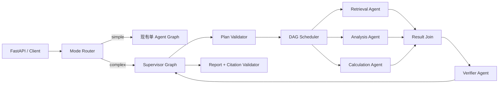
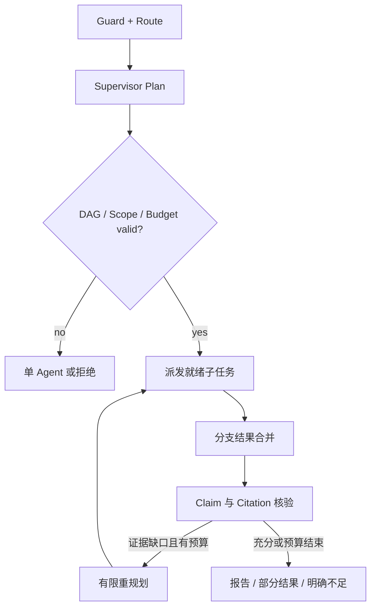
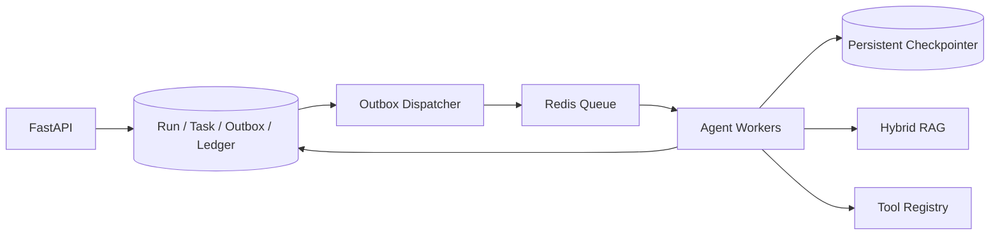

# DeepDoc Agent Multi-Agent 版本设计方案

## 1. 阶段定位与现状

Multi-Agent 是 `MVP → RAG → Agent → Multi-Agent → Eval → Production` 的第四阶段。本阶段在已有文档摄取、Hybrid RAG、Citation 和单 Agent LangGraph 上，增加**受控委派、专业分工、并行研究、交叉核验和统一汇总**。目标是改善跨知识库、跨主题、多跳及证据冲突任务，而不是让更多模型角色自由聊天。

当前仓库的 `app/agents/graph.py` 是单个 `StateGraph`：Guard、Classifier、Planner、Retriever、Tool Executor、Evaluator、Report、Validator 是职责节点，并非可独立接任务的 Agent。`app/agents/service.py` 通过 FastAPI 后台任务运行，图内使用 `InMemorySaver`；应用另把状态快照写入 SQLite。这足够做本地开发，但不等于重启后可原位恢复 LangGraph 的并行任务，也不提供多 Worker 排他执行、分支结果合并或统一成本账本。升级必须先补齐这些基础能力。

### 1.1 目标

- 针对可拆分研究任务，由 Supervisor 形成有限 DAG，向专业 Agent 发出结构化委派并聚合结果。
- 独立子任务可并行执行；依赖前序证据的子任务只能在依赖完成后执行。
- 专业 Agent 只获得必要上下文、知识库范围和工具权限，不共享无限增长的聊天记录。
- Evidence、结论和 Citation 经过去重、冲突检测、独立验证后才能进入最终报告。
- 实现持久检查点、子任务租约、取消传播、幂等重试以及总预算控制。
- 保留现有 `/v1/agent/runs` 单 Agent 路径，简单问题不增加不必要的调度成本。

### 1.2 非目标

- 不实现 Agent 间无限制对话、公开邮箱、自由创建任意角色或自我复制。
- 不开放通用代码执行、任意 URL 抓取或无人审批的写工具。
- 不在本阶段承诺多租户高可用、Kubernetes 和完整 Eval 平台；它们分别属于后续 Production、Eval 阶段。
- 不把“多节点流水线”计作 Multi-Agent：至少要有独立的子任务契约、隔离上下文、独立状态/结果与 Supervisor 委派。

### 1.3 成功判定

以冻结的单 Agent 基线对同一批复杂任务做配对比较。Multi-Agent 仅在质量收益覆盖延迟与成本时启用；每个门槛由测试集与实际模型配置共同验证，不把目标值当作现状。

| 指标 | 设计验收门槛 |
| --- | --- |
| 复杂任务成功率 | 相比单 Agent 基线绝对提升 ≥ 10 个百分点；分任务类型报告置信区间 |
| Citation Accuracy | ≥ 0.95，且不低于单 Agent 基线 |
| 关键结论证据覆盖率 | ≥ 0.95；无来源结论必须标识为未证实 |
| 委派有效率 | ≥ 0.90 的委派产生可用 Evidence 或明确失败原因 |
| 终止正确率 | 100% 用例在预算、取消或错误条件下确定终止 |
| 成本和延迟 | 简单任务不高于单 Agent 基线 1.1 倍；复杂任务成本 P95 ≤ 预设预算，延迟 P95 由配对 Benchmark 记录 |
| 恢复正确率 | 故障注入下已提交子任务不重复计费或重复写入；未提交子任务按幂等策略重试 |

## 2. 适用场景与路由

| 输入任务 | 推荐模式 | 原因 |
| --- | --- | --- |
| 单文档事实问答 | RAG 或现有单 Agent | 委派成本高于收益 |
| 单知识库简短摘要 | 现有单 Agent | 上下文与工具种类可控 |
| 多制度按维度比较 | Multi-Agent | 各维度可独立检索并交叉汇总 |
| 多知识库、多主题研究 | Multi-Agent | 需要隔离知识域与并行分支 |
| 证据冲突或法规版本差异 | Multi-Agent | 独立核验可降低自我确认偏差 |
| 严格串行多跳 | 单 Agent 或 Multi-Agent 串行 DAG | 依赖关系决定，不能假装并行 |
| 不可授权的外部写操作 | 拒绝或人工审批 | 多 Agent 不扩大原权限 |

Router 可使用确定性特征加模型候选判断，但最终由代码校验。默认 `execution_mode=auto`；API 可要求 `single` 或 `multi`，但 `multi` 仍受资格、权限、预算和并发上限约束。若任务不可拆或预算不足，自动回退单 Agent 并记录 `route_reason`。

## 3. 架构选择

选择 **Supervisor + 专业子图 + 明确依赖 DAG**。Supervisor 是唯一调度与最终输出权威；子 Agent 不直接互相调用，结果统一返回 Supervisor。独立分支采用 LangGraph 动态 fan-out/fan-in，依赖分支由调度器按 DAG 放行。此选择与官方文档的 Subagents、Router 和 Custom Workflow 模式一致；不选自由 Handoff，是因为本项目更强调统一权限、Citation 与预算控制。[LangChain Multi-agent 概览](https://docs.langchain.com/oss/python/langchain/multi-agent)



本阶段不要求所有角色都有不同模型。专业 Agent 的独立性来自输入/输出契约、工具与上下文权限、独立 checkpoint namespace 和运行指标。可先用确定性实现建立可测试基线，再逐步引入模型决策；角色名称不应掩盖共享同一段代码的事实。

### 3.1 角色职责与权限

| 角色 | 输入 | 允许动作 | 输出 | 禁止 |
| --- | --- | --- | --- | --- |
| Supervisor | 用户任务、Run 预算、权限快照 | 路由、委派、重规划、终止 | 已校验任务 DAG、最终决策 | 直接伪造 Evidence |
| Retrieval Agent | 子问题、KB/文档范围、检索预算 | Query Rewrite、Hybrid Search、Rerank | 候选 Evidence 与检索诊断 | 访问范围外知识库、直接写最终报告 |
| Analysis Agent | 指定 Evidence、比较维度 | 归纳、对比、矛盾检测 | 结构化 Claim、证据 ID、未解决问题 | 自行扩大来源范围 |
| Calculation Agent | 已定位数值、单位、表达式 | 受限 Calculator | 计算式、数值、单位、输入来源 | 任意代码执行 |
| Verifier Agent | Claim、Evidence、原文回查能力 | 独立核验引用与冲突 | `supported/contradicted/unknown`、理由摘要 | 无证据改写事实 |
| Report Generator | 通过核验的 Claim 集 | 组织报告、标注不足 | 报告草稿和 Citation 映射 | 引入新事实或新来源 |

Web Research Agent 只在受控 Web Provider、域名策略、SSRF 防护、来源可信度和用户授权均完成后注册；当前仓库的 `web.search` 仍不可用，不得在设计验收中假定已具备网页搜索。

## 4. 工作流与委派协议

### 4.1 主流程

1. Guard 校验请求、知识库权限、工具白名单和预算；Mode Router 决定单 Agent 或 Multi-Agent。
2. Supervisor 将任务拆成最多 `max_subtasks` 个子任务，定义成功标准、依赖和允许来源。
3. Plan Validator 检查 DAG 无环、子任务可执行、依赖存在、范围不越权、预计成本可承受。
4. Scheduler 只派发入度为零且资源配额足够的子任务；相互独立的子任务并行运行。
5. 各子 Agent 返回结构化 `TaskResult`，而不是一段不受限对话文本。
6. Join 按 `task_id` 去重并归一化 Evidence；超时、失败或取消的分支保留显式状态。
7. Verifier 对关键 Claim 执行原文回查、引用检查及冲突检测；只对明确缺口发起有限重规划。
8. Supervisor 决定 `COMPLETED`、`PARTIAL`、`INSUFFICIENT`、`REFUSED`、`CANCELLED`、`BUDGET_EXCEEDED` 或 `FAILED`；Report Generator 只基于通过核验的材料写报告。



### 4.2 子任务输入契约

`TaskSpec` 必须包含 `run_id`、`task_id`、`task_type`、`objective`、`success_criteria`、`depends_on`、`allowed_knowledge_base_ids`、`allowed_document_ids`、`allowed_tools`、`input_evidence_ids`、`deadline_at`、`budget_slice`、`attempt`、`graph_version`。由 Supervisor 分配 `task_id`，任何 Agent 都不能自行提高预算或增加工具。

`TaskResult` 包含 `task_id`、`attempt`、`status`、`claims[]`、`evidence_refs[]`、`tool_call_refs[]`、`unresolved_questions[]`、`usage`、`error_code` 和 `artifact_ref`。Claim 含 `claim_id`、文本、置信标签（不是概率保证）、`evidence_ids` 和 `source_type`。结果 Schema 校验失败计作子任务失败，不允许默默转为自然语言成功。

消息仅允许 `delegate`、`task.started`、`task.progress`、`task.result`、`task.failed`、`verify.result`、`run.cancelled` 等白名单事件。消息表使用 `(run_id, task_id, attempt, event_type, sequence)` 幂等键；接收端只采纳最新已提交 attempt。事件体不得包含隐藏推理、完整密钥或未经裁剪的文档全文。

### 4.3 并行与合并语义

LangGraph 可用 `Send` 从 Planner 对独立子任务动态 fan-out；归并器以 `task_id` 为键，避免简单 list reducer 因重试或乱序产生重复条目。依赖型任务在 Join 后重新计算就绪集合，不能依靠并行边自动保证依赖顺序。[LangGraph Graph API：Send](https://docs.langchain.com/oss/python/langgraph/graph-api)

每个子 Agent 子图默认按**单次委派隔离**，只继承父图在该调用期间需要的检查点；跨任务长期记忆不在本阶段默认启用。官方 Subgraphs 文档指出单次调用隔离适用于多数独立子任务，并支持并行调用；若需要持久多轮上下文，应单独设计 per-thread 模式，避免并发共享同一子图实例的检查点冲突。[LangGraph Subgraphs](https://docs.langchain.com/oss/python/langgraph/use-subgraphs)

## 5. 状态、Evidence 与引用

父图 `MultiAgentState` 只保存可恢复的权威信息：`run_id`、`mode`、`graph_version`、权限/配置快照、DAG、`task_results_by_id`、Evidence 索引、Claim 索引、预算消耗、分支状态、最终状态和事件游标。大文本及原文片段留在现有文档/Artifact 存储，仅在状态中保存不可变 ID 与摘要，避免 checkpoint 膨胀。

| 对象 | 唯一键 | 不变量 |
| --- | --- | --- |
| `AgentTask` | `(run_id, task_id)` | 依赖集合固定；重规划创建新版本而非覆写历史 |
| `TaskAttempt` | `(run_id, task_id, attempt)` | 同一 attempt 最多有一个已提交结果 |
| `Evidence` | 来源版本 + 文档 ID + chunk ID + 内容哈希 | 同内容去重但保留来源、页码、索引版本 |
| `Claim` | `(run_id, claim_id)` | 可由多个 Evidence 支持，也可被反证 |
| `Citation` | `(claim_id, evidence_id)` | 回查时引用片段仍属于授权文档版本 |
| `BudgetLedger` | `(run_id, task_id, attempt, usage_type)` | 消耗只追加；不能由 Agent 自行减少 |

在不同子图中，Evidence ID 应全局命名空间化，避免各分支的 `ev_001` 冲突；示例 `run_id/task_id/source_id/chunk_id`。合并时保留原始页码、文件名、文档版本、chunk 文本哈希、检索通道、索引版本和 Tool Call ID。跨 Agent 传递的是证据引用和必要摘录，不是未经筛选的全文。

Verifier 逐条判断关键 Claim：`supported` 需要至少一个可回查的直接证据；`contradicted` 记录冲突来源；`unknown` 不能被 Report 写成确定事实。最终 Citation Validator 再做机械校验：ID 存在、文档权限未变、页码/片段相符、引用覆盖和无孤儿 Claim。交叉核验降低风险，但并不保证消除幻觉。

## 6. 持久化、队列与故障恢复

### 6.1 前置升级

当前 `InMemorySaver` 不能在进程重启后保存 LangGraph 内部检查点；SQLite 中保存的状态快照也无法单独表达并行子图的待执行任务。因此 Multi-Agent 实施前须引入持久 Checkpointer（开发环境可使用持久 SQLite，目标架构采用 PostgreSQL）和独立 Agent Worker。FastAPI 只创建 Run 并发布任务，不直接承担长时间并行执行。官方文档明确区分 Checkpointer 的线程状态与 Store 的跨线程数据，并指出 `InMemorySaver` 重启即丢失。[LangGraph Persistence](https://docs.langchain.com/oss/python/langgraph/persistence)



队列采用至少一次投递语义；PostgreSQL 事务写入 Run/Task/Outbox，Dispatcher 负责发布，Worker 以租约和 fencing token 竞争任务执行权。Redis 可承担队列、短期节流和缓存，但不是 Run、Evidence 或 Checkpoint 的唯一真相来源。任何外部调用均使用 `(run_id, task_id, attempt, tool_call_id)` 幂等键；无法提供幂等的只读外部调用应记录重复请求风险与计费边界。

### 6.2 状态与失败策略

`TaskAttempt` 状态为 `PENDING → LEASED → RUNNING → SUCCEEDED/FAILED/TIMED_OUT/CANCELLED`。Run 状态沿用现有终态，新增 `WAITING_FOR_TASKS` 与可选 `VERIFYING` 等过程态；API 对旧客户端仍返回兼容字段。租约超时后先确认是否已有提交结果，再决定重试。仅网络超时、429、可恢复 provider 故障允许指数退避重试；Schema 错误、权限拒绝、预算超限直接终止该分支。对同一子任务至多 `max_attempts_per_task` 次。

取消请求先写持久标志，再停止新委派并向运行中分支传播；工具调用前后均检查取消与剩余预算。已完成分支不撤销，只标记最终 Run `CANCELLED` 或保留可解释的部分结果。恢复必须沿原 `graph_version`、任务计划版本、权限快照和工具版本；资源被删除或权限被撤销时拒绝继续读取，并标记明确错误，不能静默使用替代来源。

## 7. 预算、权限与安全

Supervisor 掌握总预算，子任务只拿到预算切片。控制量包括 `max_subtasks`、`max_parallel_agents`、`max_replan_rounds`、`max_attempts_per_task`、`max_duration_seconds`、`max_model_tokens`、`max_tool_calls`、`max_cost` 和 `max_evidence_bytes`。默认建议子任务 4、并行 2、重规划 1、单任务尝试 2；实际阈值需通过 Benchmark 校准。对费用采用预约额度加最终结算，避免并行分支同时看到同一剩余额度而超支。

知识库与文档权限在创建、委派、检索、引用回查时逐层校验；子 Agent 只能获得交集权限。检索结果、网页内容和其他 Agent 的自然语言输出均是**不可信数据**，不能修改系统指令、工具白名单或预算。Tool Registry 保持白名单，Calculator 继续使用受限 AST；Web 未完成安全适配前不可用。日志与事件只给出可审计的决策摘要，不存储 Chain-of-Thought。

## 8. API 与用户体验

优先扩展现有 Agent API，不破坏现有调用。`POST /v1/agent/runs` 可增加可选 `execution_mode: auto|single|multi` 与 Multi-Agent 预算字段；旧请求默认 `auto`，但在发布初期通过 Feature Flag 保持现有单 Agent 行为。`GET /v1/agent/runs/{id}` 增加 `execution_mode`、`route_reason`、`task_summary`、`budget_ledger` 和版本快照，旧字段保持不变。

新增只读 `GET /v1/agent/runs/{id}/tasks` 和 `GET /v1/agent/runs/{id}/tasks/{task_id}`；事件流复用 `/events`，增加 `task.delegated`、`task.started`、`task.completed`、`task.failed`、`verification.completed`、`budget.reserved` 等事件。SSE 保持 `Last-Event-ID` 续传和单调序号。对外只展示任务目标、状态、证据、耗时、费用和错误原因，不展示内部思维链。取消与恢复沿用原 API，保证幂等。

示例请求（目标契约，**当前尚未实现**）：

```json
{
  "question": "比较两份采购制度在审批流程和例外处理上的差异，并指出冲突条款",
  "knowledge_base_ids": ["kb-a", "kb-b"],
  "execution_mode": "auto",
  "output_format": "comparison_report",
  "budget": {"max_duration_seconds": 90, "max_subtasks": 4, "max_parallel_agents": 2}
}
```

## 9. 可观测性与评测

每个 Run、Task、Attempt、Tool Call 建立关联 ID；Trace 使用 `run_id` 根 span 和 Agent/工具子 span。指标记录任务队列等待、子 Agent 耗时、模型调用/Token/费用、检索数量、引用验证结果、重试、取消传播延迟、合并冲突及预算终止原因。事件、Trace 与 DB 状态的 ID 必须可互相定位。日志脱敏且不输出原始文档全文。

评测集按单文档简单、跨文档比较、跨知识库研究、多跳依赖、冲突条款、计算、无答案、权限拒绝、工具故障等维度分层。固定文档与索引版本、模型/Prompt 版本、随机种子和预算快照；同一问题分别跑 RAG、单 Agent、Multi-Agent，评估 Task Success、Claim Support、Citation Accuracy、Conflict Detection、Route Accuracy、Delegation Utility、Latency 和 Token Cost。消融实验分别关闭并行、Verifier、分工和重规划，确认收益来源。Eval 平台本身仍留到下一阶段。

测试至少覆盖：DAG 依赖与循环拒绝、fan-out/fan-in 乱序合并、重复投递、租约抢占、进程崩溃恢复、取消传播、预算竞争、跨 KB 越权、Prompt Injection、Citation 冲突、旧 API 回归和简单任务快速路径。故障测试要在真实持久 Checkpointer 与 Worker 组合上运行，仅 mock 单元测试不足以证明恢复正确。

## 10. 实施顺序与交付门槛

| 里程碑 | 交付内容 | 进入下一步条件 |
| --- | --- | --- |
| M1 基础设施 | 持久 Checkpointer、Agent Worker、Outbox、租约、Run 版本快照 | 单 Agent 崩溃/重启恢复测试通过 |
| M2 协议与路由 | `TaskSpec/TaskResult` Schema、Mode Router、DAG Validator、预算账本 | 越权、环依赖和超预算均被阻断 |
| M3 专业子图 | Retrieval、Analysis、Calculation、Verifier，输入隔离与版本化 | 契约、证据回查和故障测试通过 |
| M4 并行编排 | Scheduler、`Send` fan-out、幂等 Join、取消传播 | 乱序/重复/中断测试通过 |
| M5 API 与灰度 | 扩展 API、任务事件、Feature Flag、单 Agent 回退 | 回归与观测字段完整 |
| M6 Benchmark | 配对基线、消融、成本和质量报告 | 达到第 1.3 节门槛后启用默认路由 |

每个里程碑都要有迁移脚本、自动化测试、文档及独立 Git commit。若配对评测未见质量收益，默认路由继续单 Agent，Multi-Agent 保持显式实验模式。

## 11. 版本治理与回滚

Run 创建时固定 `graph_version`、`task_schema_version`、`prompt_version`、`tool_registry_version`、`retrieval_profile`、索引版本和预算策略。数据库变更先向后兼容迁移，再启用新代码；旧 Agent Run 保持旧图恢复路径。Feature Flag 按环境与租户灰度，异常时只关闭**新 Run** 的 Multi-Agent 路由；进行中的 Run 按原图继续，或在明确不可恢复时终止并说明原因。回滚演练需验证旧 API、旧 Run 查询和引用回查。

## 12. 待决策事项

1. 选择持久 Checkpointer 与业务表的事务边界，并通过崩溃注入验证一致性。
2. 决定 Agent Worker 的队列实现、租约时长和可观测性方案。
3. 明确模型供应商、各角色模型分配、计费口径及真实预算阈值。
4. 确定 Artifact 存储与 Evidence 保留期、文档版本不可变策略。
5. 基于标注样本确认 Multi-Agent 路由门槛和上线质量指标。

这些是实施前的 ADR，而非设计已解决的事实。设计依据为现有 [Agent 设计方案](agent-design.md)、[技术方案](technical-solution.md) 及上文链接的 LangGraph 官方文档。
