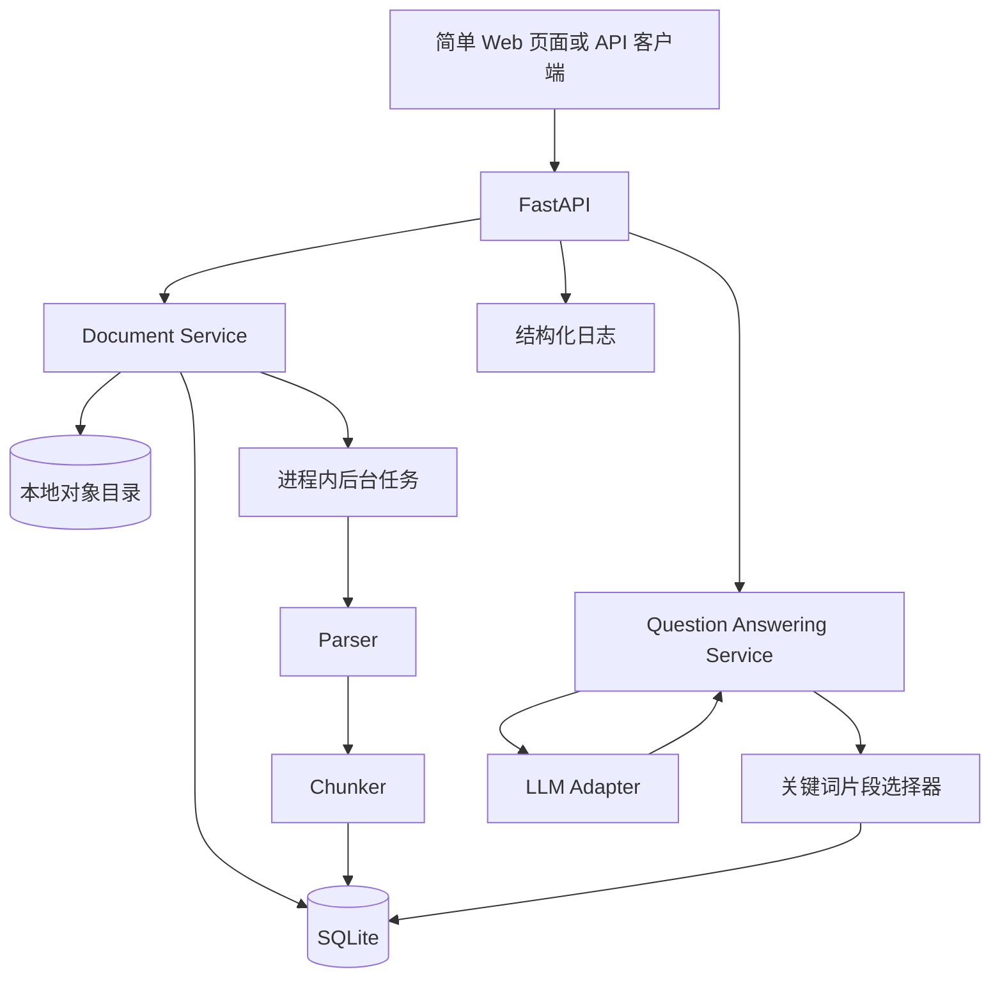
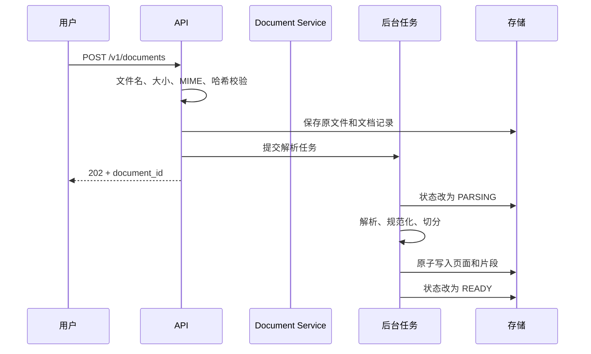
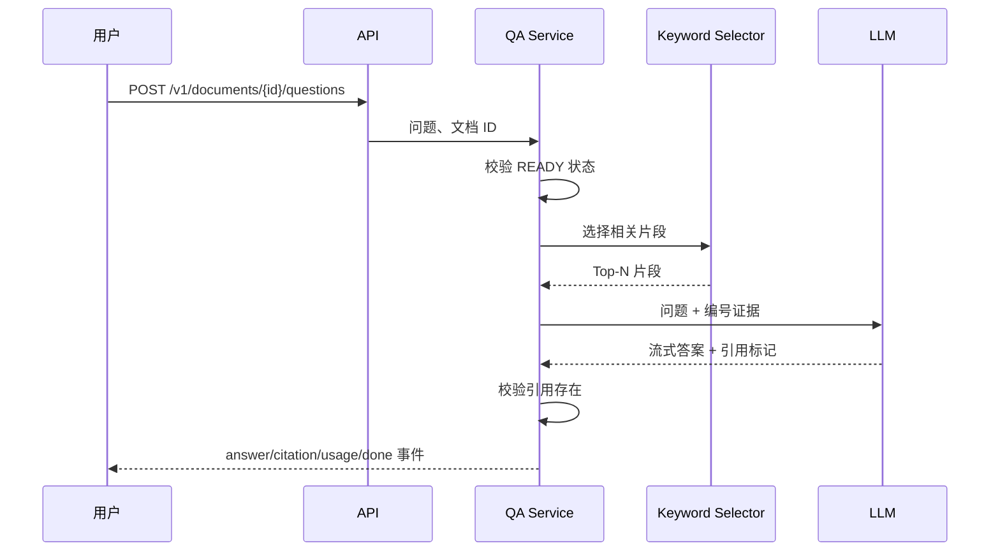

# DeepDoc Agent MVP 设计方案

## 1. MVP 定位

MVP 的目标不是提前实现完整 RAG，而是用最少组件验证 DeepDoc Agent 的核心价值闭环：

> 用户上传一份文档，系统可靠地解析文本；用户针对该文档提问，系统只依据文档内容回答，并给出可定位到页码和原文片段的引用。

MVP 完成后应验证三个关键假设：

1. 文档可以稳定进入系统，并形成可复用的结构化内容。
2. 在不引入向量数据库和 Agent 的前提下，受控上下文问答已经具备可演示价值。
3. 答案能够关联原文证据，用户可快速核验结果。

### 1.1 阶段边界

MVP 包含：

- 单用户、单工作空间。
- PDF、TXT、Markdown 三种格式，优先保证文本型 PDF。
- 文档上传、状态查询、删除。
- 异步解析、页码保留、基础段落切分。
- 单文档问答和流式输出。
- 基于关键词的候选片段筛选；短文档允许受控全文输入。
- 答案引用页码、片段 ID 和原文摘录。
- 基础错误处理、结构化日志、健康检查。
- 单元测试、集成测试和最小人工验收集。
- Docker Compose 本地运行。

MVP 不包含：

- Embedding、向量数据库、混合检索和 Reranker，这些属于 RAG 阶段。
- 任务规划、工具调用和状态图，这些属于 Agent 阶段。
- 多 Agent 协作和消息协议。
- 完整自动化评测平台；MVP 只保留可演进的样本和运行记录。
- 多租户、组织级权限、Kubernetes、高可用和自动扩缩容。
- 扫描件 OCR、表格结构恢复、图片理解和跨文档综合分析。

### 1.2 成功标准

| 目标 | 验收标准 |
| --- | --- |
| 上传闭环 | 20 MB 以内受支持文档可上传并获得文档 ID |
| 解析闭环 | 文本型 PDF、TXT、Markdown 的解析成功率为 100%（验收样本集） |
| 问答闭环 | 针对验收问题，答案只使用输入文档内容 |
| 引用闭环 | 每个事实性结论至少关联一个有效片段，页码及原文可回查 |
| 失败可解释 | 不支持格式、空文件、解析失败、模型失败均返回稳定错误码 |
| 可运行性 | 新环境通过一条 Docker Compose 命令启动 |
| 可维护性 | 核心业务具备单元和集成测试，CI 中全部通过 |

## 2. 用户故事

### 2.1 核心用户故事

1. 用户上传一份 PDF，并看到“等待解析、解析中、可用或失败”的状态。
2. 文档可用后，用户输入问题并接收流式答案。
3. 用户点击引用，可看到文档名、页码和支持答案的原文。
4. 文档中没有答案时，系统明确回复“当前文档无法支持该结论”。
5. 用户删除文档后，不能继续访问其内容或发起问答。

### 2.2 关键异常故事

- 上传扩展名伪装、超限或空文件时立即拒绝。
- 文档无法解析时状态进入 `FAILED`，并展示可理解原因。
- 文档未就绪时发起问答，返回 `DOCUMENT_NOT_READY`。
- 模型超时或限流时返回可重试错误，不生成伪造答案。
- 问题超长或为空时在 API 层拒绝。

## 3. 总体架构



### 3.1 为什么采用单体

MVP 使用模块化单体、SQLite、本地文件存储和进程内后台任务，降低部署和调试成本。模块接口仍按未来服务边界设计，RAG 阶段可替换存储和检索实现，而无需改动 API 用例层。

约束：

- 仅支持单实例运行。
- 重启可能中断后台解析任务，启动时必须扫描并恢复 `PENDING`、`PARSING` 状态。
- 本地对象目录和 SQLite 必须挂载 Docker Volume。
- 不宣称具备生产级高可用能力。

### 3.2 模块职责

| 模块 | 职责 |
| --- | --- |
| `api` | 路由、参数校验、错误映射、SSE 输出 |
| `application` | 上传、解析、问答、删除等用例编排 |
| `domain` | 文档状态、实体、错误和接口协议 |
| `ingestion` | 格式识别、解析、规范化、切分 |
| `retrieval` | MVP 关键词选择器及未来 Retriever 接口 |
| `generation` | 提示词组装、模型调用、流式解析 |
| `citations` | 引用解析、片段校验和响应转换 |
| `infrastructure` | SQLite、文件存储、LLM 供应商适配 |
| `observability` | 请求 ID、日志、耗时及用量记录 |

## 4. 核心流程

### 4.1 文档上传与解析



解析规则：

- 以服务端识别的 MIME 和文件签名为准，不只信任扩展名。
- PDF 保留页码；TXT 和 Markdown 统一记为第 1 页，并保留标题层级元数据。
- 统一换行、移除不可见控制字符，但不改写事实文本。
- 空白页可忽略，空文档标记解析失败。
- Chunk 以段落为首选边界，目标 800–1,200 字符，最大 2,000 字符，保留 100 字符重叠。
- 片段 ID 在同一文档版本内稳定，按页码和顺序生成。

### 4.2 问答与引用



候选片段选择：

- 规范化中英文标点及大小写，按词和字符 n-gram 提取问题关键词。
- 使用词频、稀有度和标题命中进行可解释打分。
- 返回 Top 8，按原文位置补充相邻片段，最多使用配置的上下文 Token。
- 文档低于上下文阈值时可直接使用全文，但仍按片段编号。
- Retriever 通过协议注入，RAG 阶段可直接替换为混合检索实现。

生成约束：

- 系统提示明确要求仅依据证据回答。
- 事实句使用 `[C1]` 形式引用，不允许引用不存在的片段。
- 证据不足时输出固定语义的拒答，不使用模型常识补充。
- 模型输出完成后解析引用；无效引用被移除并记录告警。
- 若答案含事实内容但没有有效引用，整次结果降级为“不足以回答”。

## 5. 数据模型

### 5.1 `documents`

| 字段 | 类型 | 说明 |
| --- | --- | --- |
| `id` | UUID | 文档 ID |
| `filename` | TEXT | 安全化后的展示名 |
| `media_type` | TEXT | 服务端识别类型 |
| `sha256` | TEXT | 内容哈希，唯一索引 |
| `size_bytes` | INTEGER | 文件大小 |
| `status` | TEXT | PENDING/PARSING/READY/FAILED/DELETING |
| `error_code` | TEXT | 解析错误码 |
| `created_at`、`updated_at` | DATETIME | 审计时间 |

### 5.2 `pages` 与 `chunks`

`pages` 保存文档 ID、页码和规范化文本；`chunks` 保存文档 ID、页码、顺序、文本、标题路径、起止字符偏移和字符数。删除文档时通过外键级联删除。

### 5.3 `qa_runs` 与 `citations`

`qa_runs` 保存问题、答案、状态、模型名、提示词版本、输入输出 Token、耗时和错误码。`citations` 保存运行 ID、Chunk ID、页码和引用摘录。MVP 默认不保存完整供应商请求响应。

## 6. API 契约

| 方法 | 路径 | 返回 |
| --- | --- | --- |
| `POST` | `/v1/documents` | `202`，文档 ID 与状态 |
| `GET` | `/v1/documents` | 文档列表 |
| `GET` | `/v1/documents/{id}` | 文档详情及解析状态 |
| `DELETE` | `/v1/documents/{id}` | `202`，删除状态 |
| `POST` | `/v1/documents/{id}/questions` | SSE 问答流 |
| `GET` | `/v1/qa-runs/{id}` | 完整答案、引用和用量 |
| `GET` | `/health/live` | 进程存活 |
| `GET` | `/health/ready` | 数据库、目录和配置就绪 |

统一错误结构：

```json
{
  "error": {
    "code": "DOCUMENT_NOT_READY",
    "message": "文档尚未完成解析",
    "request_id": "req_uuid",
    "retryable": true
  }
}
```

SSE 事件限定为 `metadata`、`answer_delta`、`citation`、`usage`、`error` 和 `done`。连接断开时取消模型流，已完成的结果仍可通过运行 ID 查询。

## 7. 配置与目录

环境变量包括应用环境、SQLite 路径、上传目录、文件大小上限、模型供应商、模型名、API Key、超时、最大上下文 Token 和日志级别。启动时使用 Pydantic Settings 校验，密钥不输出到日志。

```text
app/
├── api/
├── application/
├── domain/
├── ingestion/
├── retrieval/
├── generation/
├── citations/
├── infrastructure/
└── observability/
tests/
├── unit/
├── integration/
└── fixtures/
deploy/
└── docker/
```

## 8. 安全与可靠性

- 文件名重新生成存储名，禁止路径穿越。
- 限制大小、格式、页数、解析时间和模型 Token。
- 原文件不可由任意路径直接访问。
- 日志不记录 API Key、完整文档和完整提示词。
- 数据库写入使用事务；Chunk 全部成功后才进入 READY。
- 模型调用配置连接及总超时，只对限流和临时网络错误做有限重试。
- 进程启动时将遗留解析任务重新入队。
- 删除先标记状态，再清除文件和数据库记录，失败可重试。

## 9. 可观测性

每个请求生成 `request_id`，每次问答生成 `qa_run_id`。结构化日志至少记录事件、文档 ID、运行 ID、状态、耗时、模型、Token 和错误码。

MVP 输出以下基础指标：

- 上传、解析、问答的成功数和失败数。
- 解析耗时、问答总耗时、首 Token 延迟。
- 输入输出 Token 和上下文片段数。
- 无引用答案数、拒答数和无效引用数。

## 10. 测试与验收

### 10.1 自动化测试

- 单元测试：文件校验、状态机、解析器、Chunk 边界、关键词排序、引用解析、错误映射。
- 集成测试：上传到 READY、解析失败、问答 SSE、有效引用、无答案拒答、删除。
- 契约测试：使用 Fake LLM 固定流式输出，不在普通 CI 调用真实模型。
- Docker 冒烟测试：启动后检查两个健康端点并完成 TXT 上传。

### 10.2 人工验收集

准备至少 10 份小型文档和 30 个问题，其中包括 15 个直接事实、5 个摘要、5 个跨段落问题和 5 个不可回答问题。记录预期片段和页码。

MVP 发布门槛：

- 所有自动化测试通过。
- 可回答问题的引用定位准确率达到 100%。
- 不可回答问题不得捏造文档外事实。
- 验收集问答成功率达到 80%。
- 20 次连续上传、解析和问答无未处理异常。

## 11. 实施拆分

### 里程碑 M1：工程骨架

建立配置、日志、错误模型、SQLite 迁移、健康检查、测试框架和 Docker Compose。

### 里程碑 M2：文档闭环

实现上传、文件校验、文档状态、三类解析器、Chunk、后台任务、恢复和删除。

### 里程碑 M3：问答闭环

实现关键词选择器、LLM Adapter、受控提示词、SSE、引用解析与 QA Run。

### 里程碑 M4：验收交付

完成集成测试、人工样本集、Docker 冒烟测试、运行说明和已知限制。

每个里程碑均创建独立 Git commit；每项实现必须同时提交相关测试。

## 12. 向 RAG 阶段演进

MVP 必须预留以下接口：

- `DocumentParser`：后续接入 OCR、表格和图片解析。
- `ChunkingStrategy`：后续按格式和评测结果替换。
- `Retriever.search(query, document_ids, limit, filters)`：用混合检索替换关键词选择器。
- `LLMClient.stream(messages, options)`：支持模型路由。
- `CitationValidator`：后续升级为声明级蕴含校验。
- `RunRepository`：后续迁移 PostgreSQL 并接入完整 Trace。

进入 RAG 阶段的前置条件是 MVP 验收集、数据结构和 API 契约稳定。RAG 阶段重点增加 Embedding、向量索引、BM25 与向量融合、Reranker、检索评测及索引版本管理，不返工 MVP 的应用层协议。

## 13. 风险与取舍

| 风险 | 取舍与措施 |
| --- | --- |
| 关键词检索语义召回弱 | 接受为阶段限制，以验收数据建立 RAG 基线 |
| SQLite/进程内任务不能扩展 | 明确单实例，接口隔离以便后续替换 |
| 全文输入成本较高 | 设置上下文上限，超限使用关键词选择 |
| PDF 结构复杂 | MVP 仅承诺文本型 PDF，复杂格式进入后续阶段 |
| 模型仍可能产生无依据内容 | 强制引用校验，无引用事实答案直接降级 |

## 14. 完成定义

MVP 在以下条件全部满足后完成：

- 上传、解析、问答、引用、查询和删除闭环可运行。
- API 契约、数据库迁移、Docker Compose 和运行文档齐全。
- 自动化测试、Docker 冒烟测试和人工验收集全部达到门槛。
- 所有已知限制被明确记录。
- 代码、配置、文档和测试均有对应 Git commit，可追踪和回滚。

