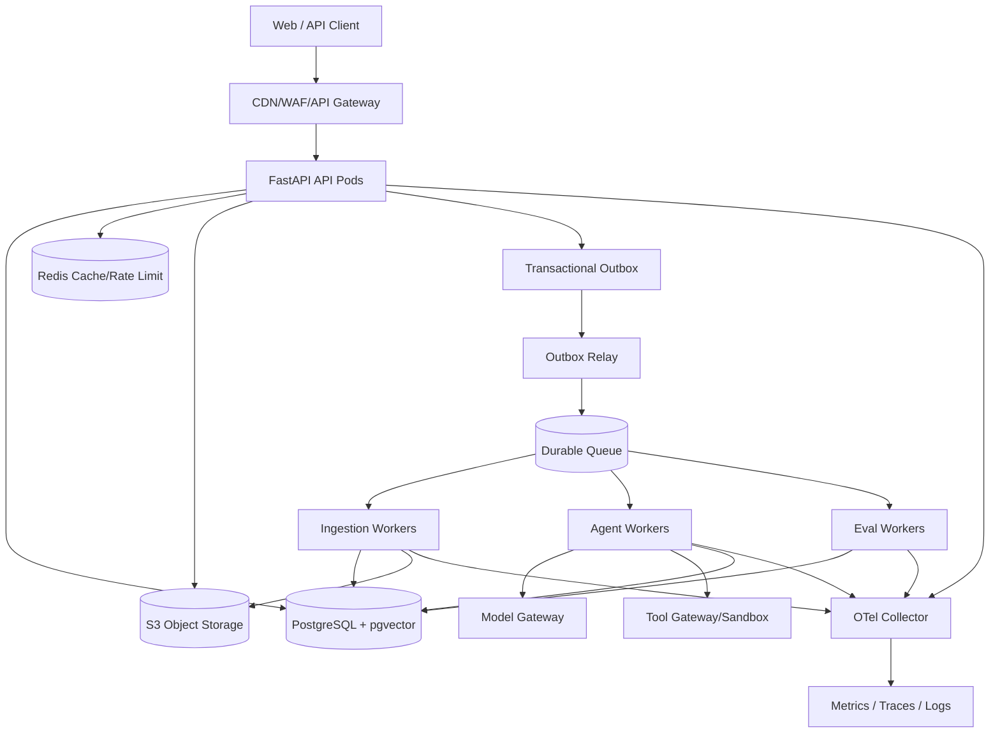
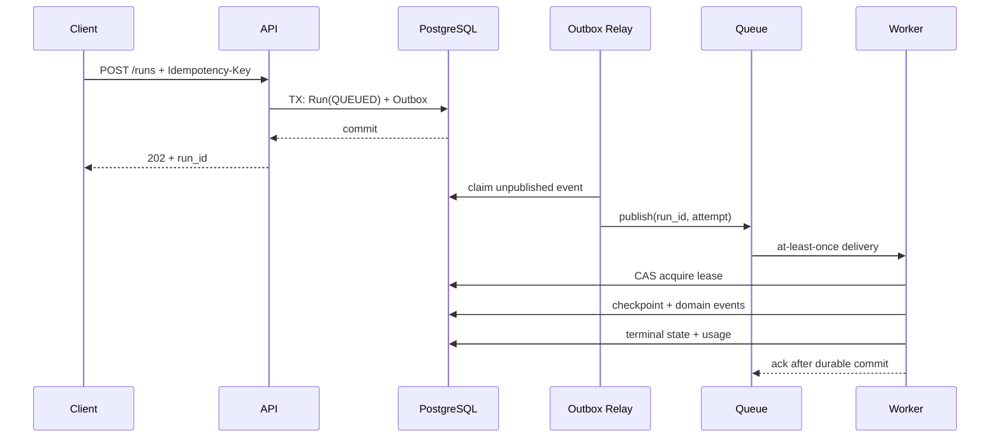
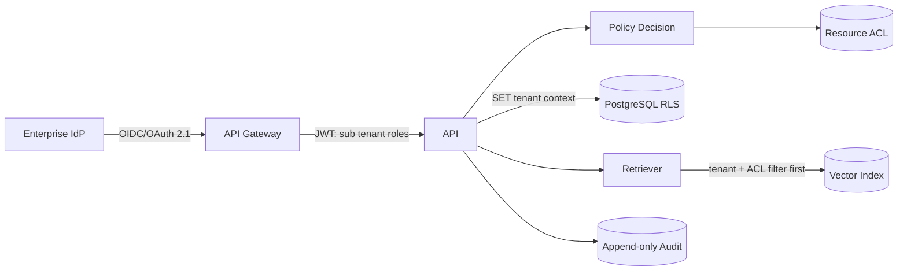
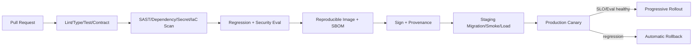

# DeepDoc Agent Production 版本设计方案

## 1. 阶段定位与当前差距

Production 是 `MVP → RAG → Agent → Multi-Agent → Eval → Production` 的第六阶段。目标不是简单把容器部署到服务器，而是让系统在真实租户、真实数据和真实故障下具备可验证的安全性、可靠性、可运维性与可回滚性。

当前 0.5.0 已具备文档摄取、混合检索、引用问答、单/Multi-Agent、持久事件、规则 Eval 和 Docker 基础，但仍是开发形态：SQLite 是单机状态源，上传文件保存在本地磁盘，长任务由 FastAPI `BackgroundTasks` 执行，服务间没有可靠消息、租约或 Outbox；评测管理令牌不是企业身份体系；Hashing Embedding、抽取式生成和确定性 Verifier 不是生产模型；缺少租户级授权、真实 Token 费用表、语义 Judge、生产 Trace、灰度、灾备演练与容量数据。

因此，Production 版本必须先关闭下列阻断项：

- PostgreSQL、对象存储、生产向量索引和 Redis 取代进程本地持久化，SQLite 只保留开发用途。
- API 与摄取、Agent、Eval Worker 分离，任务可租约领取、幂等重试、续跑、取消并进入死信队列。
- OIDC 身份、租户/资源 ACL、数据库 Row-Level Security（RLS）与检索前权限过滤形成纵深隔离。
- 真实模型、Embedding、Reranker、Prompt、价格表与安全策略全部版本化，并经过 Eval 发布门禁。
- 建立 SLO、OpenTelemetry、值班手册、备份恢复、灰度与自动回滚；完成容量、故障和安全演练。

### 1.1 建设目标

- 面向多租户企业文档提供可水平扩展、可审计、可恢复的摄取、问答与研究任务服务。
- 用户同步请求与长时任务解耦，进程退出、滚动发布或单节点故障不丢任务、不重复产生外部副作用。
- 对身份、文档、向量、缓存、模型请求、工具和 Eval Artifact 实施端到端授权与数据治理。
- 用 SLI/SLO、Trace/Metric/Log、成本账本和在线质量信号驱动告警、容量与回滚。
- 以不可变镜像、数据库扩展/收缩迁移、Eval 门禁和渐进式交付实现安全发布。
- 用明确的 RPO/RTO、备份校验和恢复演练证明灾难恢复能力，而非仅声明“已备份”。

### 1.2 非目标与边界

- 本阶段不训练基础模型，也不允许 Agent 自主执行未审批的高风险写操作。
- 不承诺完全消除 Prompt Injection；目标是通过最小权限、数据/指令分离、输出验证和工具策略降低影响面。
- 不把 Redis 当事实数据库，不把对象存储事件当唯一任务通知，不用日志重建业务状态。
- 不在没有基线压测、错误预算和成本上限时承诺具体吞吐；本文数值是初始目标，须由生产前容量测试校准。
- Production 完成定义不等于全球多区域 Active-Active；首版采用单区域多可用区，跨区域温备。

## 2. 设计原则与目标 SLO

1. **事实状态持久化**：PostgreSQL 是业务状态源，对象存储是原文与大型 Artifact 源；队列只承载待执行信号。
2. **至少一次投递、效果恰好一次**：消息可能重复，业务依靠幂等键、状态机和事务边界保证最终效果唯一。
3. **默认拒绝**：缺租户、缺权限、缺策略或依赖状态不明时拒绝访问或降级，不跨边界猜测。
4. **质量也是可靠性**：HTTP 200 但引用错误、越权召回或无终止循环均计为失败。
5. **不可评估不等于通过**：缺失 Faithfulness、Token、费用或安全门禁时禁止发布结论为 PASS。
6. **可逆发布**：代码、Schema、Prompt、模型路由、索引和策略均可独立回退。

首版服务等级目标按月计算，维护窗口是否排除须写入对外 SLA：

| 用户旅程 | SLI | 初始 SLO | 备注 |
| --- | --- | --- | --- |
| API 可用性 | 合法请求成功数 / 总合法请求数 | ≥ 99.9% | 4xx 不计平台失败，误授权计失败 |
| 在线 RAG | 端到端完成延迟 | P95 ≤ 8 秒 | 独立报告 TTFT 与完整答案 |
| Agent 接受 | 创建 Run 延迟 | P95 ≤ 500 ms | 仅代表可靠入队，不代表任务完成 |
| Agent 完成 | 预算内终态比例 | ≥ 99% | 按任务类型、模型和租户分层 |
| 文档摄取 | READY 或明确失败终态 | 99% 在 10 分钟内 | 按文件大小/格式分层 |
| 引用质量 | 在线抽样 + 离线门禁 | Accuracy ≥ 0.90 | 安全错误不允许平均稀释 |

99.9% 月可用性对应约 43.8 分钟失败预算。达到 50% 预算消耗时暂停高风险发布，达到 100% 仅允许恢复、安全和降级变更。SLO 必须使用用户视角探针校验，不能只看 Pod 存活。

## 3. 目标架构

### 3.1 工作负载拆分

| 工作负载 | 职责 | 状态与扩缩容信号 |
| --- | --- | --- |
| API | 鉴权、授权、校验、查询、SSE、创建任务 | 无本地状态；RPS、CPU、并发连接 |
| Outbox Relay | 提交事务后发布消息并标记 | Outbox age、未发布行数 |
| Ingestion Worker | 病毒扫描、解析/OCR、切分、Embedding、索引激活 | 摄取队列深度、最老消息年龄 |
| Agent Worker | LangGraph Run、检索、模型和工具调用、Checkpoint | Agent 队列、活跃 Run、模型并发 |
| Eval Worker | 回归、Judge、报告与门禁 | Eval 队列；与在线流量资源隔离 |
| Scheduler/Reconciler | 租约回收、超时、重试、保留期、账单对账 | 单实例租约或 leader election |

API 不直接执行长任务。每个 Worker 只处理自己声明的任务类型和服务账户权限；Eval 不得抢占在线 Agent 的模型与数据库连接预算。流式答案由 API 读取持久事件表或受控 Pub/Sub 加速通道，断线后使用 `Last-Event-ID` 从持久事件续传。

### 3.2 环境与故障域

- `dev`、`staging`、`production` 使用独立云账户/项目、网络、数据库、Bucket、密钥和模型凭据。
- 生产集群跨至少三个可用区部署 API 与 Worker；有状态服务优先使用托管多可用区产品。
- Namespace 不是强租户边界；平台工作负载通过 Namespace、ServiceAccount、NetworkPolicy 和工作负载身份隔离。
- 控制面、在线数据面与离线 Eval 设独立资源配额、优先级和 PodDisruptionBudget。

Kubernetes Readiness 失败会让 Pod 停止接收 Service 流量，Liveness 用于处理无法恢复的进程故障，Startup Probe 保护慢启动；三者不得共用一个只返回 200 的空壳检查。[Kubernetes Probe 官方文档](https://kubernetes.io/docs/tasks/configure-pod-container/configure-liveness-readiness-probes/)

## 4. 请求、任务与一致性模型

### 4.1 幂等与状态机

- 创建类接口接受 `Idempotency-Key`，作用域为 `tenant_id + route + key`，保存请求体哈希、响应和有效期；相同键不同请求体返回 409。
- Run 状态只允许 `QUEUED → RUNNING → COMPLETED|PARTIAL|FAILED|CANCELLED|BUDGET_EXCEEDED`；转换使用版本号 CAS，禁止终态回到运行态。
- Worker 通过 `lease_owner`、`lease_expires_at`、`attempt` 领取任务并周期续租；过期任务由 Reconciler 回收。
- 外部工具的写操作必须有业务幂等键或两阶段“提议—用户确认—执行”协议；无法幂等的写操作不自动重试。
- Outbox 与业务行同事务写入，Relay 可重复发布；消费者先检查 `event_id`/任务状态再执行。
- 重试只覆盖分类为瞬时且幂等的错误，采用指数退避、抖动和最大尝试次数；永久失败进入 DLQ 并保留诊断信息。

### 4.2 Checkpoint 与取消

LangGraph Checkpoint 迁移到 PostgreSQL，并以 `tenant_id/run_id/thread_id/checkpoint_version` 建唯一约束。每个可重放节点必须隔离副作用；模型和检索结果保存必要摘要与版本，避免恢复时静默换模型或索引。取消先写持久标志，Worker 在节点边界和长调用中检查；超时后终止下游请求并释放租约。

## 5. 数据平台与迁移

### 5.1 PostgreSQL 与向量

- 元数据、ACL、Run、Checkpoint、事件、引用、Eval 结果、Outbox 和用量账本存 PostgreSQL。
- 每张租户业务表必须含非空 `tenant_id`；主键或唯一键包含租户维度，外键禁止跨租户关联。
- 应用连接在事务开始设置可信 `tenant_id` 上下文，RLS 作为应用授权之外的第二道防线。启用 RLS 而没有适用策略时 PostgreSQL 默认拒绝访问，但表 Owner 通常可绕过，因此应用角色不能拥有表。[PostgreSQL RLS 官方文档](https://www.postgresql.org/docs/current/ddl-rowsecurity.html)
- `pgvector` 首版与元数据共库，先按租户/知识库/索引版本做过滤再向量检索；规模或延迟超过阈值后通过 ADR 评估独立 Qdrant，而非同时维护两个事实索引。
- 在线连接使用连接池，API、Worker、Eval 设置独立池与上限；长事务、空闲事务和无界查询必须超时。

### 5.2 对象存储、Redis 与保留期

- 原文件、解析 Artifact、报告和大 Trace 存版本化对象存储；数据库保存不可猜测对象键、SHA-256、大小、加密键版本和保留策略。
- 上传使用短时预签名 URL 或流式上传，完成后再写 `UPLOADED`；解析前校验大小、媒体签名、Hash 和恶意内容扫描结果。
- Redis 仅用于缓存、分布式速率计数和短时事件加速。缓存键包含环境、租户、ACL 版本、索引版本、模型/Prompt/检索配置；权限变化主动失效，TTL 只是兜底。
- 删除采用 `DELETION_REQUESTED → tombstone → 索引删除 → 对象删除 → VERIFIED`，保留审计事件；法律保留优先于常规 TTL。

### 5.3 Schema 与数据迁移

采用 Expand/Contract：先添加兼容列/表并双写或回填，验证后切读，最后在后续发布删除旧结构。迁移 Job 与应用镜像同版本，但有独立服务账户、超时、锁等待和人工批准；禁止应用 Pod 并发自动执行破坏性 DDL。

SQLite 到 PostgreSQL 分四步：冻结 Schema 映射与 ID；全量导出并校验行数/Hash；短期双写和影子读比对；维护窗口切换事实源并保留只读回退快照。切换前演练回滚，切换后禁止双主写入。

## 6. 身份、授权与租户隔离

- Gateway 验证 issuer、audience、签名、有效期和撤销策略；API 只信任网关或重新验证 Token，绝不接收客户端自报 `tenant_id`。
- RBAC 表示组织角色，ABAC/ACL 控制知识库、文档、Eval 数据集和工具；授权判断发生在 API、数据库、检索、对象签名和工具调用各边界。
- 后台任务携带创建时的主体、租户和授权快照标识，但执行前重新检查资源有效性；权限撤销必须阻止未开始任务继续读取。
- ServiceAccount 使用工作负载身份获取短时凭据，生产不把长期云密钥、数据库密码或模型密钥写入镜像、Git、环境文件或 Trace。
- Eval 管理令牌只用于本地兼容；生产替换为 IdP 管理员角色和资源级策略，并审计数据集发布、门禁变更和 Holdout 访问。

## 7. LLM、检索与工具安全

文档、网页、用户输入和工具返回都视为不可信数据。OWASP 指出 Prompt Injection 的根因之一是自然语言指令与数据混合，并可能导致越权访问、系统提示泄漏和未授权工具操作；生产控制必须放在模型之外。[OWASP LLM Prompt Injection Prevention](https://cheatsheetseries.owasp.org/cheatsheets/LLM_Prompt_Injection_Prevention_Cheat_Sheet.html)

- Prompt 使用结构化消息隔离系统策略、用户目标和证据；证据明确标为不可执行内容，过滤隐藏指令不能代替授权。
- Model Gateway 统一 Provider 白名单、区域、超时、并发、Token/费用预算、重试、内容策略、响应 Schema 和 Usage 采集。
- 租户策略决定数据能否发往外部 Provider；敏感级别高的文档只走获批区域/本地模型，Provider Zero-Retention 声明仍需合同和技术验证。
- Tool Registry 固定名称、Schema、权限、网络目的地、超时、响应上限和副作用级别。默认禁网；Web Search 通过出口代理执行 DNS/IP 再校验、域名策略和响应大小限制。
- 读工具按 Run 权限执行；写工具需显式用户确认、幂等键、结果回执和审计。模型不能生成凭据、策略或任意 URL 来扩大权限。
- 生成后执行引用回查、结构化 Schema、敏感信息和策略校验；高风险任务不能只依赖另一个 LLM Judge 放行。

## 8. 可观测性、审计与成本

OpenTelemetry 原生区分 Trace、Metric、Log 与 Baggage，项目使用 W3C Trace Context 跨 API、队列、Worker、模型和工具传播上下文。[OpenTelemetry Signals 官方文档](https://opentelemetry.io/docs/concepts/signals/)

### 8.1 遥测规范

- Span：`http.request`、`queue.publish/consume`、`agent.node`、`retrieval`、`rerank`、`model.call`、`tool.call`、`citation.verify`、`db.query`。
- 统一关联字段：`trace_id`、`request_id`、`tenant_id_hash`、`run_id`、`task_id`、`model_version`、`prompt_version`、`index_version`、`deployment_version`。
- Metric：RPS、错误率、P50/P95/P99、TTFT、SSE 断开、队列深度/年龄、租约回收、DLQ、空召回、引用失败、Token、费用和缓存命中。
- Log 使用结构化 JSON 和稳定错误码；禁止记录原文、Prompt、答案、JWT、Cookie、API Key 和对象预签名 URL。调试采样须审批、脱敏并有短保留期。
- Trace 默认按比例头采样；错误、高延迟、安全事件采用 Collector 尾采样。指标标签禁止原始用户、文档、问题或 Run ID，避免高基数失控。

### 8.2 审计与成本账本

审计记录谁在何时对哪个租户资源执行了何种动作、策略结果和变更前后版本；使用追加写、受限访问和完整性校验，审计管理员不得修改业务内容。模型 Provider 返回的实际 Token、缓存 Token和请求 ID原样记入用量账本，价格表按生效时间版本化；估算值必须单列。预算控制按租户、Run、日/月和 Provider 多层执行。

## 9. 可靠性、降级与灾难恢复

### 9.1 故障矩阵

| 故障 | 用户行为 | 自动处理 | 禁止行为 |
| --- | --- | --- | --- |
| Reranker 超时 | 继续回答并标记降级 | 回退 RRF，计数告警 | 静默冒充完整链路 |
| Vector 查询失败 | 可配置关键词降级 | 熔断、BM25、缩短上下文 | 跨租户放宽过滤 |
| 主模型失败 | 重试一次或走批准备模 | 保持 Prompt/策略兼容 | 无限重试或换未审批 Provider |
| 工具失败 | PARTIAL/明确错误 | 幂等重试、保留证据 | 伪造工具结果 |
| PostgreSQL 不可用 | 503，不接收新任务 | 连接熔断、故障转移 | 把 Redis 当事实源继续写 |
| Queue 不可用 | Outbox 保留待发布 | 恢复后补发 | 先返回 202 却未持久化 Run |
| Worker 退出 | Run 暂停后续跑 | 租约过期回收 | 同一副作用并发执行 |

### 9.2 备份、RPO 与 RTO

- PostgreSQL 使用跨可用区同步/托管高可用，WAL 归档与每日全量备份支持 PITR；官方 PITR 依赖基础备份与连续 WAL 序列。[PostgreSQL PITR 官方文档](https://www.postgresql.org/docs/current/continuous-archiving.html)
- 对象存储启用版本化、服务端加密和跨区域复制；备份账户与生产写权限分离，防止同一凭据删除主数据和备份。
- 首版目标：区域内单实例故障 RTO ≤ 15 分钟、RPO ≈ 0；区域灾难 RTO ≤ 4 小时、RPO ≤ 15 分钟。模型 Provider 故障的 RTO 由降级策略单独定义。
- 每季度从备份恢复到隔离环境，验证 Schema、行数、对象 Hash、引用回查、RLS 和关键用户旅程；只有成功恢复记录才算备份有效。

## 10. Kubernetes 部署与容量

- API、Relay、三类 Worker、Collector 分别使用 Deployment；一次性迁移用 Job；托管 PostgreSQL/Redis/对象存储不塞入应用 Helm Release。
- Pod 使用非 root、只读根文件系统、最小 Linux capabilities、seccomp、固定镜像 digest、资源 requests/limits 和临时目录配额。
- API 至少 3 副本，滚动发布设置 `maxUnavailable: 0`；配置 PodDisruptionBudget、拓扑分散与反亲和，避免单节点/单区集中。
- Readiness 检查进程能否接流量和关键配置是否有效；不因可降级的模型 Provider 短暂失败摘除全部 API。Liveness 只检查本进程死锁；数据库迁移不放在 Probe。
- API 用 `autoscaling/v2` 按 CPU、RPS/并发连接扩容；Worker 按队列深度和最老消息年龄扩容。HPA 支持自定义指标，KEDA 可将事件源指标交给 HPA，并保留重试、DLQ 与 Checkpoint 语义。[Kubernetes HPA](https://kubernetes.io/docs/concepts/workloads/autoscaling/horizontal-pod-autoscale/) [KEDA Worker 扩缩容](https://keda.sh/docs/2.20/concepts/scaling-deployments/)
- 扩容上限必须受数据库连接、Provider RPM/TPM、工具并发和预算约束；高队列不意味着可以无界增加 Worker。

容量模型至少输入峰值 RPS、平均/P95 Token、并发 SSE、文档大小、每天 Chunk 增量、Embedding QPS、队列服务时间和重试率。压测分为 API 接受、热/冷 RAG、Agent 长任务、批量摄取和 Eval；结果记录环境、数据规模、缓存、模型限额和成本，不能用 Mock 模型延迟代表生产模型。

## 11. CI/CD、供应链与渐进发布

- PR 门禁：格式、Lint、类型、单元、集成、契约、迁移兼容、安全测试和无外部费用的固定 Eval。
- Release 门禁：Holdout/Adversarial Eval、生产模型 Token/费用、镜像与依赖扫描、SBOM、Schema dry-run、staging E2E、负载与恢复检查。
- 构建一次、按 digest 晋级，不在各环境重新构建。CI 通过 OIDC 获取短时云凭据，不保存长期部署密钥；GitHub 官方说明 OIDC 可让工作流用短时令牌访问云资源。[GitHub Actions OIDC](https://docs.github.com/en/actions/concepts/security/openid-connect)
- 生成并验证镜像 provenance/attestation；Attestation 证明构建来源与过程，不代表镜像本身安全，仍须策略和扫描。[GitHub Artifact Attestations](https://docs.github.com/en/actions/concepts/security/artifact-attestations)
- 先迁移兼容 Schema，再发布 canary。按内部租户、1%、10%、50%、100% 推进，观察至少一个完整业务周期；错误预算、越权、引用安全或费用异常立即自动停止并回退。
- 回滚应用只切回上一镜像 digest；Prompt、模型路由、Feature Flag 和索引有独立版本开关。Contract 阶段的破坏性数据库变更不能依赖镜像回滚恢复。

## 12. 在线质量、Eval 与发布治理

离线 Eval 继续作为变更门禁，Production 增加不保存敏感正文的在线信号：拒答率、空召回率、Citation 回查、用户反馈、工具拒绝、模型错误、Token/成功任务和分层延迟。在线指标异常触发调查或回滚，但不能未经授权自动把真实问答加入训练/评测集。

- 每次 Run 保存代码、镜像、Prompt、模型、检索、索引、工具 Schema、价格表和策略版本。
- 1%–5% 获授权流量做去标识化质量抽样；Judge 只接收允许的证据，并持续用人工样本校准。
- 安全、越权和伪造引用是硬门禁；平均质量提升不能抵消任何严重安全失败。
- A/B 按租户或会话稳定分桶，避免同一会话跨策略；实验必须有停止条件、最小样本和成本上限。
- 当前规则 Eval 不足以放行 Production：E4 固定 Judge/人工校准、真实费用、Holdout 与安全基线必须先完成。

## 13. 测试与演练策略

| 层级 | 必测内容 | 通过标准 |
| --- | --- | --- |
| 单元/属性 | 状态转换、策略、幂等、费用、引用 | 边界和随机输入稳定 |
| 契约 | 模型、Embedding、队列、对象、工具、IdP | 超时/错误/Usage 契约固定 |
| 集成 | PostgreSQL/RLS、Outbox、Worker、Checkpoint | 重复投递效果唯一 |
| E2E | 上传→索引→问答→引用→删除 | 多租户真实依赖通过 |
| 安全 | 越权、SSRF、注入、恶意文件、凭据泄漏 | 严重用例零通过漏洞 |
| 负载/稳定性 | 峰值、突发、SSE、长跑、连接池 | SLO 与资源预算内 |
| 混沌 | Pod/节点/队列/Provider/DB 故障 | 降级、恢复、无状态损坏 |
| 灾备 | PITR、对象恢复、跨区切换 | 达到 RPO/RTO 且证据完整 |

发布前故障注入必须覆盖 Worker 在模型调用后、Checkpoint 前退出；Outbox 发布后、标记前退出；SSE 断线重连；租约过期并发领取；权限在排队期间撤销；索引切换中途失败；Provider 返回未知 Usage；DLQ 重放。所有演练有预期、观测证据和清理步骤。

## 14. 运维、告警与事件响应

- 告警必须映射用户影响和 Runbook：高错误率、SLO burn rate、队列年龄、DLQ、数据库饱和、跨租户拒绝异常、费用突增和引用安全失败。
- 使用快/慢双窗口 burn-rate 告警降低噪声；仅资源利用率高但没有用户影响时进入容量告警，而非最高级事故。
- Runbook 包含判断、仪表盘、止血、降级/回滚、数据校验、升级路径和恢复确认；季度 GameDay 验证可执行性。
- 事件级别、值班、沟通、取证、复盘和整改负责人明确。安全事件优先撤销凭据、隔离租户/工具并保全审计，禁止为排障扩大数据访问。
- Feature Flag 必须有 Owner、到期日和默认安全值；紧急开关覆盖 Web Search、写工具、外部模型、答案缓存、Multi-Agent 和在线 Judge。

## 15. 分阶段迁移路线

| 里程碑 | 交付 | 退出条件 |
| --- | --- | --- |
| P0 基线与 ADR | SLO、数据分级、威胁模型、容量基线、供应商决策 | 阻断 ADR 获批，Eval 缺口有 Owner |
| P1 数据层 | PostgreSQL/pgvector、对象存储、RLS、迁移工具 | 双写/校验/回滚演练通过 |
| P2 异步运行时 | Outbox、Queue、独立 Worker、租约、DLQ、Checkpoint | 杀进程/重复消息/续跑测试通过 |
| P3 安全治理 | OIDC、ACL、工作负载身份、工具网关、审计 | 跨租户与注入安全门禁通过 |
| P4 可观测与 SRE | OTel、Dashboard、SLO、告警、成本账本、Runbook | 故障能定位，Token/费用可核查 |
| P5 交付平台 | K8s、HPA/KEDA、签名、SBOM、灰度、回滚 | staging 压测和 canary 自动回退通过 |
| P6 DR 与上线 | PITR、跨区温备、GameDay、值班与 SLA | RPO/RTO、质量与安全验收完成 |

每个里程碑独立提交代码、IaC、迁移、测试、文档和运行证据。不得将 P1–P5 合并为一次“大爆炸”切换；Production 流量只在 P6 验收后逐步开放。

## 16. 关键 ADR 与风险

上线前至少确认：消息系统及投递语义、PostgreSQL/pgvector 容量边界、租户隔离级别、对象存储区域与保留、模型/Embedding/Reranker Provider、敏感数据外发策略、Tool Egress、价格表来源、SLO/SLA、RPO/RTO、观测后端、部署平台、密钥管理与审计保留。

| 风险 | 控制与残余风险 |
| --- | --- |
| 跨租户召回 | API ACL + RLS + 检索前过滤 + 安全回归；索引实现错误仍需持续测试 |
| 重复工具副作用 | Outbox、幂等键、确认协议；第三方无幂等能力时禁止自动写 |
| Prompt Injection | 最小权限、数据隔离、工具策略、输出校验；模型层无法完全消除 |
| Provider 依赖 | 多 Provider 适配、限额、降级；质量差异必须先 Eval |
| Schema/索引切换 | Expand/Contract、影子读、原子激活；大回填需容量窗口 |
| 遥测泄密 | 默认不采正文、脱敏、RBAC、保留期；调试采样需审批 |
| 成本失控 | 多层预算、实际 Usage、价格表、异常检测；Provider 对账仍可能滞后 |
| 备份不可恢复 | 隔离恢复和季度演练；跨区域灾难仍受基础设施恢复速度影响 |

## 17. Production 完成定义

只有以下条件全部满足，才可以声明 Production 版本完成：

- API、Ingestion、Agent、Eval 和 Relay 已解耦，进程/节点故障下任务可续跑且外部副作用不重复。
- PostgreSQL、向量、对象存储、Redis 和 Queue 的事实边界明确；SQLite、本地上传和 FastAPI 后台任务不承载生产状态。
- OIDC、租户 ACL、RLS、检索前过滤、对象授权、工作负载身份和审计经过跨租户渗透与回归测试。
- Eval 阶段遗留的固定 Judge、人工校准、Holdout、安全基线、真实 Token 与费用门禁已完成，候选版本明确 PASS。
- SLO、错误预算、Dashboard、告警、Runbook、值班与事件响应经过 GameDay 验证。
- 生产容量、限流、Provider 配额与成本预算经过峰值和稳定性压测；结果可复现且不使用 Mock 延迟冒充。
- 镜像以 digest 部署，具有 SBOM、签名/来源证明和扫描记录；灰度、自动停止、应用/Prompt/模型/索引回滚均演练通过。
- PostgreSQL PITR、对象恢复和跨区温备达到批准的 RPO/RTO，并留有最近一次恢复证据。
- 数据迁移、删除、保留、隐私请求和密钥轮换有可执行流程；无未解决的高危安全问题。
- 所有自动化测试、文档验证和发布门禁通过，并为变更创建对应 Git commit。

完成后仍需持续运营：Production 是具备反馈、演练和改进机制的运行状态，不是一次性部署终点。
