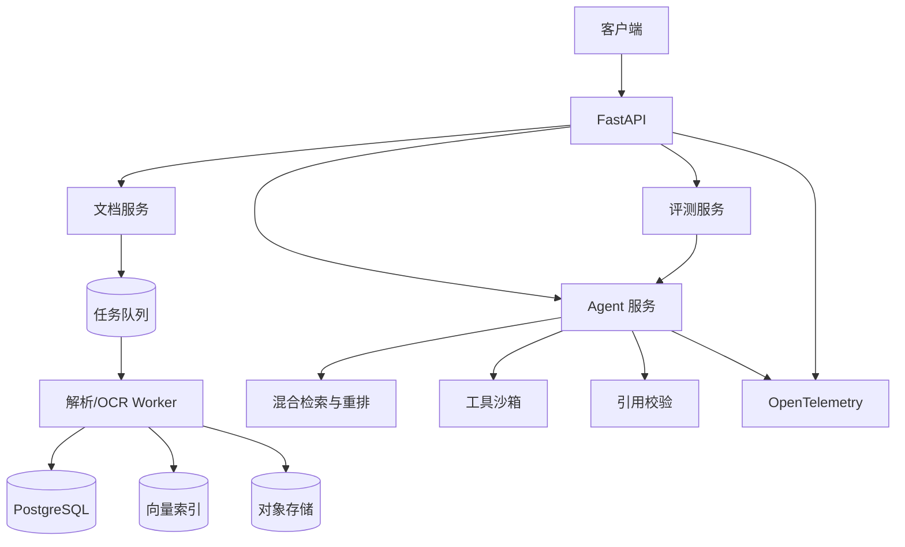
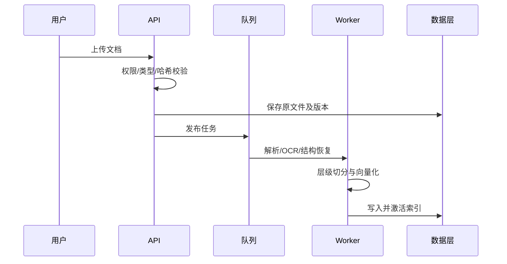
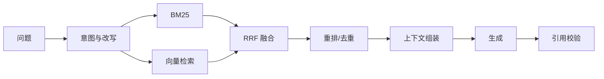
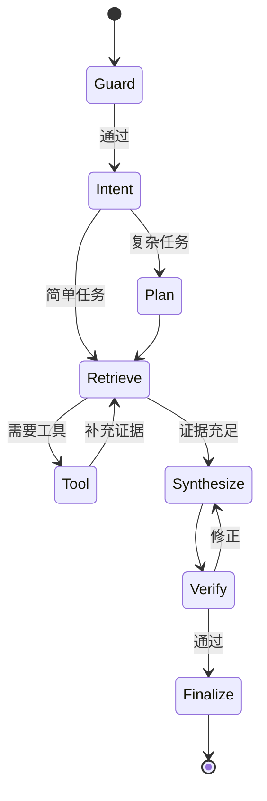

# DeepDoc Agent 技术方案

## 1. 文档概述

DeepDoc Agent 面向复杂文档问答、研究分析与证据核验，通过 Agent 编排、混合检索、引用溯源和自动评测，提供可验证、可观测、可持续优化的文档分析能力。

建设目标：

- 统一解析 PDF、DOCX、Markdown、HTML、TXT 等文档。
- 支持意图识别、任务拆解、检索规划、工具调用和答案校验。
- 将关键结论定位至文档版本、页码、坐标和原文片段。
- 量化评估检索质量、忠实度、任务成功率、延迟和成本。
- 基于 FastAPI、Docker 和 OpenTelemetry 实现生产级服务。

首期范围包含文档摄取、知识库、多轮问答、跨文档分析、Agent 工具、引用校验、评测和可观测性；不包含协同编辑、模型训练平台及无人确认的高风险写操作。

| 指标 | 首期目标 |
| --- | --- |
| Recall@5 | ≥ 0.85 |
| Citation Accuracy / Faithfulness | ≥ 0.90 |
| Task Success Rate | ≥ 0.85 |
| 在线问答 P95 | ≤ 8 秒 |
| 解析成功率 | ≥ 99% |

## 2. 需求分析

核心用例为异步文档摄取、带引用问答、跨文档比较、多跳研究任务、答案核验、策略 Benchmark 和链路诊断。

非功能要求包括 99.9% 可用性目标、水平扩容、租户隔离、幂等重试、结果可复现和请求级 Token、费用、迭代及超时预算。

## 3. 总体架构

| 层级 | 职责 | 技术建议 |
| --- | --- | --- |
| 接入 | 鉴权、限流、SSE | FastAPI、Pydantic |
| Agent | 规划、工具、状态、校验 | 显式状态图 |
| 检索 | 改写、召回、融合、重排 | BM25 + Vector + Reranker |
| 数据 | 元数据、向量、对象、缓存 | PostgreSQL、pgvector、S3、Redis |
| 观测 | Trace、Metric、Log | OpenTelemetry |

本地采用 Docker Compose；生产将 API、摄取 Worker、Agent Worker 和有状态依赖分离部署，并按请求量、队列深度及延迟扩缩容。

## 4. 技术选型

使用 Python 3.12、FastAPI、Pydantic、PostgreSQL、pgvector、Redis、S3 兼容存储、pytest 和 OpenTelemetry。模型、向量库、对象存储及工具均通过抽象接口访问，避免供应商锁定。

## 5. 文档摄取与知识加工

统一 DocumentNode 保存节点类型、文本、页码、坐标、标题路径、父节点、表格结构和 OCR 置信度。采用结构感知父子切分：子块 300–500 Token 用于召回，父块 1,000–1,500 Token 用于上下文，最终参数由评测决定。

租户、文件 SHA-256 和解析配置版本组成幂等键。更新产生新文档版本；新索引验证后原子切换，失败不得影响活动版本。

## 6. RAG 检索增强生成

权限和元数据过滤必须在召回前完成。BM25 捕获术语、编号和数字，向量检索捕获语义，多路结果经 RRF 及交叉编码器重排。证据块具有稳定 evidence_id；检索文本按不可信数据隔离，防止间接提示词注入。

缓存键包含租户、知识库、索引、模型和检索配置版本；答案缓存仅用于非敏感、非个性化的确定性问题。

## 7. Agent 设计

状态包含请求、租户、会话、意图、计划、证据、工具结果、草稿、引用、校验、预算和错误，并按节点持久化。

节点包括 Guard、Intent、Planner、Retriever、Tool Executor、Synthesizer、Verifier 和 Finalizer。每个请求设置检索轮次、工具次数、Token、费用和总截止时间等硬限制。

工具以 JSON Schema 注册参数、返回类型、权限及超时。读写能力分离，高风险写操作要求用户确认；执行环境限制网络、文件、凭据和资源。

## 8. 引用与忠实度保障

引用包含声明、文档及版本、Chunk、页码、坐标、原文、字符偏移、检索分数和蕴含分数。系统将草稿拆成声明，逐条检查实体、极性、数字、时间和范围，标记支持、部分支持、矛盾或无支持，再删除、修正或标记不确定内容。

## 9. 数据与 API

核心实体包括租户、用户、知识库、文档版本、结构节点、Chunk、索引版本、会话、Agent Run、引用和评测运行。解析配置、模型、提示词和索引统一版本化。

核心接口包括 /v1/documents、/v1/query、/v1/agent/runs、/v1/citations、/v1/evaluations/runs 及健康检查。错误响应包含业务码、request_id、可重试标志和详情，不暴露密钥、提示词或堆栈。

## 10. 自动化评测体系

数据集覆盖事实、摘要、对比、多跳、表格数字、冲突、不可回答、注入和权限边界，并保存标准答案、相关 Chunk、预期引用及配置版本。

| 类别 | 指标 |
| --- | --- |
| 检索 | Recall@K、MRR、nDCG@K |
| 生成 | Faithfulness、相关性、完整性 |
| 引用 | Citation Precision/Recall/Accuracy |
| Agent | Task Success Rate、工具成功率 |
| 性能成本 | P50/P95、TTFT、Token、单次成功成本 |

规则评测负责数值、偏移和延迟，固定 Judge 负责语义质量，人工抽检用于校准。发布门禁要求质量不显著回退、性能成本在预算内、安全用例全部通过。

## 11. 可观测性设计

request_id、trace_id 和 agent_run_id 关联全链路。Span 覆盖鉴权、规划、检索、重排、工具、生成、校验和流式响应，记录配置版本、候选数、Token、缓存命中、错误码和耗时，不记录敏感原文。

监控请求分位延迟、队列深度、解析成功率、空召回率、模型费用、工具超时率、引用通过率和无支持声明率，并为异常趋势配置告警。

## 12. 安全与治理

- OIDC/OAuth 2.1 认证，RBAC 与资源级 ACL 授权。
- 数据库、向量、缓存和评测均执行租户隔离。
- TLS、静态加密、集中密钥管理及敏感信息脱敏。
- 系统指令、用户指令、文档和工具输出严格隔离。
- 安全评测覆盖恶意文档、间接注入和跨租户访问。

## 13. 可靠性与降级

仅重试幂等操作，使用指数退避、熔断和死信队列。重排故障回退融合排序，主模型故障切换兼容模型，向量故障降级为关键词检索。引用校验失败时不输出未经验证的强结论。

## 14. 测试策略

测试分为单元、适配器契约、摄取及问答集成、端到端、评测回归、安全和负载测试。重点验证幂等索引、租户隔离、引用定位、数字极性校验、Worker 恢复、配置复现和 Agent 确定性终止。

## 15. CI/CD 与部署

每次合并运行静态及类型检查、单元和契约测试、镜像扫描、集成测试、核心评测回归、API 兼容及迁移检查。策略、提示词、模型路由和索引支持灰度、版本切换及独立回滚。

## 16. 推荐目录

应用按 api、application、agents、retrieval、ingestion、citations、evaluation、infrastructure 和 observability 分包；测试按 unit、integration、contract、e2e 和 evaluation 分层；部署资源放在 deploy/docker 与 deploy/kubernetes。

## 17. 分阶段实施路线

1. **最小闭环**：完成 API、摄取、切分、索引、混合检索、生成、页级引用、追踪和基础测试。
2. **Agent 与校验**：完成规划、状态图、预算、工具治理、声明级校验、多文档及多跳任务。
3. **评测与生产化**：完成版本化数据集、Benchmark、发布门禁、多租户安全、灰度、弹性和灾备。

## 18. 风险与架构决策

解析结构丢失以格式回归集治理；语义误召回以混合检索和校验治理；长上下文以层级切分和预算治理；Agent 循环以硬限制治理；Judge 漂移以人工校准治理；跨租户召回以检索前过滤治理。

实施前使用 ADR 确认向量库、状态持久化、OCR 路线、模型回退、评测数据策略和观测后端。

## 19. 完成定义

代码、配置、迁移和文档同步更新，相关测试全部通过，关键观测数据可用，安全影响已评审，性能及 Token 成本已量化，并创建对应 Git commit 后方可交付。

